Normally people will make entire articles out of things like Big O notation, Binary search or other algorithms. There simply is no need to blabber on about something when you can convey the same message in a shortened manner, so this is where this article comes into play.

If you're not interested in a certain algorithm (say for example, Min and Max) then simply skip it! Most of the examples given are in Python, but you need not know how Python works to understand the algorithms. Note that later in this article some algorithms may be implemented in Java.

I do not attempt to explain my code used that much. You should really try to implement this yourself in code (if you're a programmer) and perhaps use my code to check over it. My code is definitely not the _best_ way to implement it, but it is a way.


# Table of Contents
1. [What is an Algorithm?](#what-algorithm)
2. [Algorithm Complexity, Big O notation](#big-o)
    1. [Big-O tips](#big-o-tips)
    2. [Big-O Summary](#big-o-summary)
    3. [Big-O Cheatsheet](#big-o-cheatsheet)
3. [Searching Algorithms](#sequential-search)
    1. [Sequential Search](#sequential-search)
    2. [Binary Search](#Binary-search)
4. [Min and Max Algorithms](#min-max)
    1. [Coding the Min algorithm](#min-code)
    2. [Codign the Max algorithm](#max-code)
5. [Datastructures](#datastructures)
    1. [Queues](#queue)
    2. [Stacks](#stack)
    3. [Linked Lists](#linked-list)
        1. [Singly Linked Lists](#singly-linked-list)
        2. [Doubly Linked Lists](#doubly-linked-list)
        3. [Traversing Linked Lists](#traversing-linked-lists)
        4. [Programming Linked Lists](#programming-lniked-lists)
            1. [Adding a Node to the Head of a Linked List](#linked-lists-head-add)
            2. [Deleting a Node at the Head of a Linked List](#delete-head-lniked-list)
            3. [Inserting an Item into a Linked List](#inserting-linked-list)
            4. [Searching a Linked List](#searching-linked-list)
6. [Sorting Algorithms](#sorting-algorithms)
    1. [Bubble Sort](#bubble-sort)
        1. [Coding a Bubble Sort](#coding-bubble-sort)
    2. [Selection Sort](#selection-sort)
        1. [Coding a Selection Sort](#coding-selection-sort)
    3. [Insertion Sort](#insertion-sort)
        1. [Coding an Insertion Sort](#coding-insertion-sort)
7. [Programming Linked Lists - Sorts](#programming-linked-lists)
    1. [Bubble Sort in a Linked List](#bubble-sort-linked-list)
    2. [Programming a Bubble Sort in a Linked List](#programming-bubble-sort-linked-list)
    3. [Selection Sorts in a Linked List](#selection-sort-linked-list)
    4. [Insertion Sort in a Linked List](#insertion-sort-linked-list)
    5. [Inserting a New Node into an already sorted linked list with Insertion Sort](#insertion-sort-linked-list-expanded)


<a name="what-algorithm"></a>
# What is an Algorithm?

An algorithm is a set of instructions typically undertaken by a computer to reach a targeted goal.

When you make a sandwich, you are performing an algorithm. Habits are algorithms. Do you put your socks and shoes on in the order sock > sock > shoe > shoe or do you do sock > shoe > sock shoe? Both of these are algorithms.

>Algorithms have a long history and the word can be traced back to the 9th century. At this time the Persian scientist, astronomer and mathematician Abdullah Muhammad bin Musa al-Khwarizmi, often cited as “The father of Algebra”, was indirect responsible for the creation of the term “Algorithm”. In the 12th century one of his books was translated into Latin, where his name was rendered in Latin as “Algorithmi”.

From [here](http://cs-exhibitions.uni-klu.ac.at/index.php?id=193)

Normally algorithms break down things that we as humans think are very simple and easy into little steps that a computer can perform.

Let's say you want to find the number 3 in the list [1, 2, 3]. You look at it and you see it, but a computer can't see the number 3 in the list until it goes through every single item to check.

Computers are the fastest dumbest things to ever be created.

Algorithms are essential in Computer Science, you simply cannot live without them. Something computer scientists do a lot is compare how long an algorithm takes to run against other algorithms.

<a name="big-o"></a>
# How do we measure how long an algorithm takes to run?

We could simply run an algorithm 10,000 times and measure the average time taken but let's say we have an algorithm that took different inputs, like say for example we have an algorithm that takes a list of items and prints every item to the screen. If we only input lists of length 1 (1 item), the average time would be around 0.1 seconds. If we entered items of length 1500, the average would be different. Of course you can use some advance statistical knowledge to work out the true average by inputting lists of varying lengths or you could use Big O notation.

Big 0 notation is notation used to describe how efficient an algorithm is. It's incredibly important to know this since every major employer will question you on this and it'll most likely come up in any algorithms exams (Hello University of Liverpool people <3 ).

A hierarchy of functions exist:

   1     |   log n   | n, $$n^2$$, $$n^3$$ |   $$2^n$$
-------- | --------- | ------------------- | -----------
Constant | Logarithm | Polynomial          | Exponential

Where the further right they are, the longer it takes. Big O notation uses these functions to describe algorithm efficiency.

Log is called a logarithm (typically in base 2 binary but can differ). I shan't explain the logistics of logarithms for someone has already done it far better than I can. You do not need to watch the whole video, perhaps just the first two minutes.

https://www.youtube.com/watch?v=ZIwmZ9m0byI

A "constant" value is something that does not change depending on its input. So for example, adding 1 to 500 is the same as adding 1 to 4741838148, because it doesn't scale depending on the input size.


In Big O notation, we always use the *worst case* scenario for our calculations.

To calculate the Big O of an algorithm or selection of code, well... it's basically an educated guess. If your algorithm touches EVERY item in a list, the algorithm is 0(n). If your algorithm does not rely on input size (like an algorithm which just does 2 * n) then it is considered 0(1). If your algorithm appears to be halving / going down a lot it is _probably_ log n. If your algorithm looks like it's counting up in how memory is counted (16, 32, 64, 128, 256, ..., 1024) then it is probably 2^n. 

There are some super useful rules you have to obey in order to simplify your algorithm.

<a name="big-o-tips"></a>
## Drop the constants

If you have an algorithm described as O(2n), drop the 2 so it's just O(n).

## Drop the non-dominant terms

O(n^2 + n) just becomes O(n^2). Only keep the larger one in Big O.

If you have a special sum such as
O(b^2 + a)
you can't drop either because without knowledge of what b and a are.

<a name="big-o-summary"></a>
## Summary

Bet you were expecting some hard to understand guide to Big O huh? Well, this is all it is. You just need to memorise (or learn) the hierarchy, take some algorithms and find out what their Big O notation is. 

Big O notation only represents how long an algorithm can take but sometimes we care about the memory (space complexity) of an algorithm too.

I read somewhere that if you have a for loop and another for loop nested inside of that for loop (2 for loops) then it's likely to be $$n^2$$. 3 for loops is $$n^3$$.

There are other forms of measuring algorithm time complexity such as Big Theta which is the least (smallest)amount of time an algorithm takes.

<a name="big-o-cheatsheet"><a>
## Cheatsheet

Some of these algorithms you may not know yet, but they will all be explained in this article.


   Algorithm    |   Big O
--------------- | ----------
Sequential Sort | O(n)
Binary Search   | O(log n)
Minimum Value   | O(n)
Maximum Value   | O(n)
Quicksort       | O(n^2)
Mergesort       | O(n log n)
Bubble Sort     | O(n^2)
Insertion Sort  | O(n^2)
Selection Sort  | O(n^2)
Dijkstra's      | O(n^2)


|   Data Structure   | Access | Search | Insertion | Deletion |
| ------------------ | ------ | ------ | --------- | -------- |
| Array (list)       | O(1)   | O(n)   | O(n)      | O(n)     |
| Stack              | O(n)   | O(n)   | O(1)      | O(1)     |
| Queue              | O(n)   | O(n)   | O(1)      | O(1)     |
| Singly-Linked List | O(n)   | O(n)   | O(1)      | O(1)     |
| Doubly-Linked List | O(n)   | O(n)   | O(1)      | O(1)     |
| Binary Trees       | O(Log n)|O(log n)|O(log n)  | O(log n) |

Search Algorithms for Graphs / Trees | Time Complexity | Space Complexity
--- | --- | --- | ---
Breadth First Search | $$B^d$$ | $$B^d$$
Depth First Searxh | $$B^m$$ | bm
Depth Limited Search | $$B^{l}$$ - where l is the depth limit | bl where l is the depth limit
Iterative Deepening Search | $$B^d$$ | bd
Bi-directional search | $$\frac{b}{2}$$ | $$\frac{b}{2}$$


<a name="sequential-search"></a>
# Sequential Search

Let's say you have an array of items [1, 3, 7, 4, 9] and you want to find the number 4. You just look at it, and you see it. What's so hard about that? Well a computer doesn't have super cool abilities like us just to "see" things. It has to go through the list in order to "see" the number. There are many algorithms that allow a computer to search lists / arrays. One of them is sequential search.

A sequential search would calculate it like so:

Index | Current number | Description
--------------| --- | -----------
0             | 1 | Not goal
1             | 3 | Not goal
2             | 7 | Not goal
3             | 4 | Goal found

Note: this type of table is called a trace table. It shows the values and names of all variables in the algorithm every single time the algorithm / loop is run until the algorithm finishes.

Essentially you are sequentially counting up every single item in an list until you find your goal (if it exists in the list).


Note: this algorithm is sometimes called linear search.

In the *worst case scenario* the number we are looking at is either not in the list or at the very end, so in time complexity this is O(N).

```python
for i in list: # for every element in the list
    if i == answer: # if you selected the element and it's the answer then
        print(answer) # print it to the screen
    else:
        continue # else continue searching
```

Now this may seem stupid, but it can work on non-sorted arrays. You use this search a lot in daily life, like looking for a book or looking for an item on a menu.

<a name="Binary-search"></a>
# Binary search

Binary search only works on sorted arrays. It basically halves the array and checks whether the halved item is lower or higher than the goal item in the array.

Given the array [1, 2, 3, 4, 5, 6, 7, 8, 9, 10] and we want to find 2 we can run binary search like this:

```
Item in middle of array = 5
is 5 less than or greater than 2? It's greater than so we throw away the right hand side (greater than) and start again.
5 / 2 = 2.5, so we round up here. 
Is 3 less than or greater than 2? It's greater than so we do:
3 / 2 = 1.5
round up to 2 (as we only accept integers here)
2 is goal, goal is found.
```

The time complexity here is O(log n) because you're effectively asking how many times can you divide by 2 until you find the answer.

Here is a nice gif of binary search in action


This is the worst case performance for binary search, beaten by sequential search!


This code is taken from [here](https://stackoverflow.com/questions/41883258/how-to-implement-a-binary-search). It's not essential to understand the Python code in order to understand the algorithm. 


```python
def bsearch(alist, target):
    left = 0
    right = len(alist)-1

    while True:
        mid = int((left + right)/2)
        if alist[mid] < target :
            left = mid + 1
        elif alist[mid] > target :
            right = mid + 1
        elif alist[mid] == target :
            print ("word '" + target + "' found at " + str(mid))
            break
        elif left > right:
            print ("Not Found!")
            break  

i = input("Enter a search >")
alist = ["rat","cat","bat","sat","spat"]
alist.sort()
bsearch(alist, i)
```

If you're a Java programmer, have a look at this code:

```java
// sortdata[] is an array in ascending order, n is size of array, key is the number we want to find
static void binary_search(int[] sortdata, int n, int key) {
		int count;
		boolean found = false;

		// start binary search on the sorted array called sortdata[]
		found = false;	// to indicate if the number is found
		count = 0;	// to count how many comparisons are made
		
		int temp = n - 1;

        while (found == false){
            if (sortdata[temp] == key){
				found = true;
			}
            else {
                if (temp < key){
                    temp = temp / 2;
                }
                else {
                    temp = temp + (temp / 2);
				}
			count = count + 1;
            
            }
        }               
		System.out.print("The number " + key + " is ");
		if (found == false)
			System.out.print("not ");
		System.out.println("found by binary search and the number of comparisons used is " + count);
	}
}
```

This method may suit your book search better because books are normally sorted alphabetically! If you know the alphabet and the positional number of each letter you could easily find any author you wanted!

<a name="min-max"></a>
# Min and Max algorithms

How do you find the biggest and smallest numbers in an array?

Well, first: why is this useful? Can't you just look at a list and tell?
Yes, *you* can but a computer cannot.

## Finding maximum from n +ve (+ve means positive) numbers

So given an array, A, of positive only numbers this is how you would find the maximum.

Quick note: read ":" as "then".

```python
i = 0
m = A[0]
while i <= n:
    if A[i] > m:
        m = A[i]
    i = i + 1
print(M)
```

Assume A is an array of n positive numbers and m is the maximum number.

Can you guess the time complexity of this?

It's O(N).

Let's try a quick example. Given the array [2, 6, 3, 4] how does the computer know what number is biggest? How best can we break down this problem into little chunks?

Well, we'll simply run the code.

At first, 2 is the largest number. Then 6 is, 3 isn't larger than 6 and 4 isn't larger than 6 so we return 6 as the largest number in the array.

<a name="min-code"></a>
## Finding minimum from N +ve (positive) numbers (code)

What if we wanted to find the minimum? Well, we simply turn the ">" sign into a "<" sign.
```python
i = 0
m = A[1]
while i <= n:
    if A[i] < m:
        m = A[i]
    i = i + 1
print(m)
```

<a name="datastructures"><a>
# Dipping our toes into data structures - Queues and Stacks

A data structure is a way to structure data in such a way that the data becomes easily usable and maybe even faster to use than a typical list or array.

<a name="queue"></a>
## Queues

A queue is a first-in-first-out array. The *first* item into the array is the *first* item out of the array.

Queues have 2 functions:
* Enqueue - Insert element to tail (end).
* Dequeue - Retrive data from head (start) of queue.

So given an array (list) as an example

```python
[15, 20, 10, 0]
```

The *head* points to array[0] which is the first item in the array, it does not point to the data contained in the first item.
The *tail* points to array[end], where end is the length of the array + 1. In this instance tail results in 5, for their are 4 items in the list and then you add 1.

It's actually up to the developer who designs this as to whether tail points to length + 1 or whether it points to length.

The reason tail always points to something that doesn't exist is because enqueue is implemented to always put an object at [tail]. If we were to make tail the same as the length than enqueue would be changed to [tail + 1]. Either way you are adding 1, so it does not matter and may change in some languages.

If we want to *enqueue* 12 into the queue, we would add it onto the end like so:

```python
[15, 20, 10, 0, 12]
```

And the tail increases to index 6, but head stays at index.

*Dequeue* takes the [head] of the list and enqueue places an item at the [tail] of the list.

```python
x = [20, 10, 0, 12]
```

which results in head = 1 and tail = 5. The head variable increased because we dequeued something. The head variable is also useful for other things such as knowing how many items have been taken out of a queue. 

If the head and the tail are the same and you have a 1 dimensional array like so:

```python
x = [1]
```

then in some programming languages you can only get the head() of the queue (Haskell, i'm looking at you) but in other languages this may differ.


Why are queues useful? Well, queues are extremely useful. Imagine lining up at the bank and waiting 30 - 40 minutes to get to the front. When you get to the front, the teller decides a queue isn't useful so they start from the back, making you the last person they reach.

<a name="stack"></a>
## Stacks

A stack is a *last-in-first-out* array.

In a lot of online tutorials stacks are drawn vertically like so:

  0 |
:---: |
  1 |
  2 | 
  3 |

Much like a stack of plates, the first item on the top is the first item to come off. You can't pull plates out of the bottom of a stack of plates (if you can, you should become a magician!).

Stacks have 2 functions:
* Push - Insert element to the location top + 1
* Pop - Delete element from top

Where "top" is the variable for the number of items in the stack. If there are 2 items in the stack, the top pointer will point to stack index [1]. Because we always index from 0, this represents 2 which is 2 items in the stack.

Let's see some examples.

```python
x = [20, 10, 15]
```

Where top is "2" because there are 3 elements.

So to push 12 onto this stack we'll get

```python
x = [20, 10, 15, 12]
```

Now top becomes 3.

You may be wondering "what happened to adding +1 to head?". Well, like I said, you can use both notations. I want to expose you to as much variance in algorithms as possible to enrich your learning... Well, at least that's what my professor said to me once.

Now if we want to pop() a stack we'll get:

```python
x = [20, 10, 15]
```

and head = 2, since we've popped the top!

Stacks are super useful, especially in browser history. Say for example you go to Google, then Medium, then my profile (follow me 😉). The stack will look like:

Brandon's Profile |
:---------------: |
Medium |
Google |

Now how much would it suck if you pressed "back" and it went back to Google? It would suck a lot! So when we click "back" the browser, quite literally, pops the current web-page off of the stack and brings you to the next item.

Stacks grow _downwards_ by placing stuff on top of it. This may sound confusing, so I'll try to explain it.

When you *push* something onto a stack, you're changing the head of the stack to go down 1 level. We'll visualise this. Let's imagine a stack that looks like this:

```
[a][b][c]
```

There are no rules as to whether stacks can be sideways or top down, but normally they're top down. If we want to *push* something into the stack we do this:

```
[x][a][b][c]
```

Which pushes all the contents of the stack down.

In normal stack-like behaviour this looks like:

Follow me on Twitter|
:------------------: |
Medium |
Google |

Now we push "University of Liverpool" to the stack and it becomes:

University of Liverpool |
:---------------------: |
Follow me on Twitter |
Medium |
Google |

Literally pushing the stack down.


Think of stacks like leaving breadcrumbs for yourself. If you're ever lost in a maze and you place down all the breadcrumbs, you'll look for the last breadcrumb you placed down, which is usually the one closet to you.

<a name="linked-list"></a>
# Linked Lists

Linked Lists are a linear collection of data elements except the linear order is not defined by their physical placement in memory but instead each data node points to the next.

Linked lists are much faster for inserting data into because you don't need to shift the entire array to add an item. They're very useful for when the space of the plausible values could be very large but you don't know when it will grow to that size.

Linked lists are scalable and adaptable.

The order is determined by a pointer (rather than array indices).
Each element (node) has a data field and one or two pointers linking to the next or previous elements in the list

There are two types of linked lists, singly linked and doubly linked.
<a name="singly-linked-list"></a>
Singly link looks like

```
[15][-]-> 
```

Where ```->``` represents a pointer and each ```[]``` represents a component.


In a singly linked list the node stores one piece of data (the 15) and it stores a pointer linking it to the right hand side. The pointer does not contain data, just a pointer. In my badly drawn diagram the pointer, the arrow which is literally pointing out of the right hand side box is a pointer pointing to the next node. Each set of these data with pointers is a node.

A singly linked list cannot point to the previous node.

<a name="doubly-linked-list"></a>
Doubly linked list looks like:

```
<-[-][15][-]->
```

In a doubly linked list the node has a forward and backward pointer as well as a data object. Each node has 3 components, 1 piece of data and 2 pointers. In a doubly linked list you can go to the previous node.

Linked lists have a few functions we can use such as:

* node.data = get data from current node
* node.next = go to next node
* node.prev = go to previous node

The notation used may be different in programming languages.

Note: if the node you are looking at is the last node in the linked list then node.next results in None (as in, it does not exist) and if you try to run node.prev in a singly linked list it will error.


```
head -> [ ][15][<-]---[->][10][<-]---[->][20][ ]  <- tail
```

Something important to stress again is that a node in a doubly linked list has *3 components* and each ```[ ]``` represents 1 component so a group of ```[ ][ ][ ]``` represents *1 node* and in this diagram there are *3* nodes respectively.


If my badly-drawn diagrams in ASCII art are confusing then this picture may help:


<a name="traversing-linked-lists"></a>
## Traversing Linked Lists

We can traverse and output each element of a linked list like so:

```python
node = head
while node != None: # while node does not equal None, where != is not equal to
    print(node.data) # output the data of the node using the Python print function
    node = node.next # updates the node variable to contain the next node in the list
```

Notice how we are using the node.next function to traverse a linked list.

At Merriam Webster they have dictionaries with reversed words. So Ecology would be ygolcoe. If you wanted to know how many words ended in "cology" you simply would search all words that ended in "ygolco". Of course, reading it like this is annoying so you can use a doubly linked list to be able to search a dictionary both the original alphabetical way and the reverse way. [Thanks 99PI](https://99percentinvisible.org/episode/mini-stories-volume-4/).

You could program a data structure (doubly linked list) that when you go to a previous node it displays the data in reverse if you really wanted too. This is just an example of something I thought about whilest writing this.

## Big O

Searching for and traversing through linked lists is O(n).

<a name="programming-lniked-lists"></a>
# Programming Linked Lists

Because the linked lists data structure isn't in every language (very commonly it is not) we have to program linked lists ourselves.

So below is a node for a doubly linked list. The node has 3 components, previous, data, next. A class is a template you can apply to objects, so in this instance we can make new nodes using this class.

```java
class Node {
	public int data; 
	public Node next;
	public Node prev;
    
	// constructor to create a new node with data equals to parameter i
	public Node (int i) {
		next = null;
		prev = null;
		data = i;
	}
}
```

In this instance the node has 3 methods that can be applied to it. Each method can be applied like:

```
Node.next
Node.prev
Node.data
```

using the dot notation.


If we wanted to make a single node in a doubly linked list we can do this:

```java
Node newnode = new Node(5);
```

Where the node will hold a data value of 5.
<a name="linked-lists-head-add"></a>
If we wanted to add a new node to the front of the list we can use this function:

```java
// create a new node containing data value 
// and insert the new node to head of the list
static void insertHead(int value) {
	Node newnode = new Node(value); // makes a new node with value

	newnode.next = head; // Makes the next node the head of the linked list
	newnode.prev = null; // makes the previous node empty
	if (head != null) // if the head is empty
		head.prev = newnode; // sets the previous node to the new node to be inserted
	else
		tail = newnode; // the last node in the list is now the new node
	head = newnode; // the head of the list is the new node
	}
```

This code will create a new node and insert this node at the front of the doubly linked list. This is quite confusing, so let's draw some diagrams.

First we create a new empty node with value as data.

```
[ ][value][ ]
```

Then we set the next pointer to point at the head of the linked lists. This assumes that there is already a linked list we are adding to.

```
[ ][value][-]-[>][HEAD][ ]
```

After this we set the previous definition to be NULL

```
NULL<-[-][value][-]-[>][HEAD][ ]
```

Then we run a simple if statement. If head is not empty, set the previous node (new node) as our head node. Otherwise if head is empty (as in this node is the only node in the linked list) do something. Normally you'll set head to the new node to the head but in some cases you may not want this.

```
NULL<-[-][value][<-]-[>][HEAD][ ]
```

In some programming languages, the following logic may be used: If head is empty, set the tail (last) node to be the new node. This is because if you insert this node into a linked list that doesn't exist, the next node would be nothing so the node you just inserted will be both the head and tail. Otherwise, just ignore the next node as it contains data.

The last line sets the head pointer to point to the new node which is at the front of the list.

This part is entirely down to the programmer as to how they want to implement linked lists. This is the part where you write in your documentation how your linked list works (assuming you have documentation).

<a name="delete-head-lniked-list"></a>
We can also delete a node at the front of the linked list in a similar fashion:

```java
// delete the node at the head of the linked list
static Node deleteHead() {
	Node curr;

	curr = head;
	if (curr != null) {
		head = head.next;
		head.prev = null;
	}
	return curr;
}
```

We assume here that curr is a pointer that points at a node in the linked list.

So we point the current pointer at head, if head is not null (if it is not empty) then we set the head to the next node and from this new head (which is the second item in the linked list) we set the previous (old head) to null (null definition: nothing, doesn't exist).

<a name="inserting-linked-list"></a>
## Inserting items into a linkedlist

Linked lists are super cool because we can insert items anywhere in them. Let's say we have a pointer, curr, which points somewhere (let's say the middle) of the list. We can insert a new node after curr like so (in Python now)

```python
def listInsert(L, curr, newnode):
    newnode.next = curr.next
    newnode.prev = curr
    if curr.next != None:
        curr.next.prev = newnode
    curr.next = newnode
```

Whenever we want to insert a new node, we just have to tell the node what the next and previous nodes are.

<a name="searching-linked-list"></a>
## Searching over a sorted linked list

Recall that values stored in a linked list are normally sorted (again, entirely down to the programmer). We could use binary search to search the list. However, this is a bad idea. We don't know where the middle of a linked list is. Everytime we wanted to find the middle we would have to count every single node in the list and half that by 2.

We can use a modified version of sequential search to search a linked list.

Because the linked list is sorted, let's say in ascending order, we can use this information to make sequential search faster.

```python
node = head
while node != None and node.data < key:
    node = node.next
if node == None:
    print("Not found")
else if node.data > key:
    print("not found")
else:
    print("found")
```

Since the linked list is sorted sequentially we know that the nodes in the linked list go in some order, like 1, 2, 3, 4, 5 for example. If node.data is more than the key (what we're looking for) we know it's not in the list, because it is sorted.

So if we wanted to find 2.5 we would do this:

```
1 is selected
is 1 goal? - no
is 1 > 2.5? no
2 is selected
is 2 goal? no
is 2 > 2.5? no
3 is selected
is 3 goal? no
is 3 > 2.5? yes - we can assume 2.5 is not in list and thus end the search here
```

There are many, many search algorithms but most of the time if you know a little bit of information about the data you can change some search algorithm to be more efficient for that specific problem. In general, binary search is extremely effective but here it's not so good. Don't just use an algorithm because Stack Overflow says that it is the fastest, best algorithm for the job.

Algorithms are like programming languages, we all have our favourites and sometimes we say that one programming language is better than another (Python, I love you) but at the end of the day it would be foolish and naive to say that one programming language is better than all the others. Use the right tool for the job, and change it if you want to!

Personally whenever I am presented with a problem I like to imagine it is in its own separate world. I try to imagine what rules of life apply to this world. Once you understand the rules (a rule being like our linked list is sorted ascending) you can work out the best tool and change that tool to fit perfectly to the job.

PS: A blockchain is an immutable linked list with some extra features.

<a name="sorting-algorithms"></a>
# Sorting Algorithms

Let's say you have a bookshelf and you want to arrange the books alphabetically, this is a sorting problem and the way you go around sorting the books is a sorting algorithm.

<a name="bubble-sort"></a>
## Bubble Sort

The idea of a bubble sort is simple. Starting from the first element, swap adjacent items if they are not in ascending order. When the last item is reached, the last item is the largest. Repeat these steps for the remaining items to find the second largest, third largest and so on.

Most of these sorts are shown as sorting in ascending order. You can sort in descending too if you wanted. If it has some sort of hierarchy, if it can be sorted by some set of rules than you can modify a sorting algorithm to sort it.

Bubble sort is often the first sorting algorithm one learns because it's easy to implement.

Here's a new gif of how Bubble Sort works.


### Big O

The Big O complexity for bubble sort is $$O(n^2)$$.
<a name="coding-bubble-sort"></a>
### Code

Here is some Python code for the bubble sort:

```python
def bubbleSort(alist):
    for passnum in range(len(alist)-1,0,-1):
        for i in range(passnum):
            if alist[i]>alist[i+1]:
                temp = alist[i]
                alist[i] = alist[i+1]
                alist[i+1] = temp

```

And here is the Java version:

```java
public static void BubbleSort( int [ ] num )
{
     int j;
     boolean flag = true;   // set flag to true to begin first pass
     int temp;   //holding variable

     while ( flag )
     {
            flag= false;    //set flag to false awaiting a possible swap
            for( j=0;  j < num.length -1;  j++ )
            {
                   if ( num[ j ] < num[j+1] )   // change to > for ascending sort
                   {
                           temp = num[ j ];                //swap elements
                           num[ j ] = num[ j+1 ];
                           num[ j+1 ] = temp;
                          flag = true;              //shows a swap occurred 
                  }
            }
      }
}
```

You'll notice that bubble sort heavily uses a temporary variable for temporary storage.

<a name="selection-sort"></a>
## Selection Sort Algorithm

The selection sort algorithms tries to do the following:
* Find minimum key from the input sequence
* Delete it from input sequence
* Append it to the resulting sequence
* Repeat until nothing left in input sequence

Example, where bold face means it's in the right place.


[34, 10, 64, 51, 32, 21]     |   To Swap
-------------------------------- | ------------
[34, 10, 64, 51, 32, 21]         | 34, 10
[*10*, 34, 64, 51, 32, 21        | 34, 21
[*10*, *21*, 64, 51, 32, 34]     | 32, 64
[*10*, *21*, *32*, 51, 64, 34]   | 34, 51
[*10*, *21*, *32*, *34*, 64, 51] | 51, 64
[*10*, *21*, *32*, *34*, 51, 64] | Fully sorted

As you can see there is fewer swaps than in Bubble Sort. It finds the lowest value and swaps it with the closet to first in the list where it isn't in the right place.

Here's a gif representing how selection sort works:


## Big O

The Big O notation for Selection Sort is O(^2)
<a name="coding-selection-sort"></a>
### Code

Here's some Python code for selection sort:

```python
def selectionSort(alist):
   for fillslot in range(len(alist)-1,0,-1):
       positionOfMax=0
       for location in range(1,fillslot+1):
           if alist[location]>alist[positionOfMax]:
               positionOfMax = location

       temp = alist[fillslot]
       alist[fillslot] = alist[positionOfMax]
       alist[positionOfMax] = temp
```

<a name="insertion-sort"></a>
## Insertion Sort

The idea is as follows:
* Look at elements one by one
* Build up sorted list by inserting the element at the correct location

Hence why it's called insertion sort, because you are inserting hte values into a new array.

      [34, 10, 64, 51, 32, 21]       | No. shifted to right
------------------------------------ | --------------------
[34, 10, 64, 51, 32, 21]             | Nothing yet
[10, 34, 64, 51, 32, 21]             | 34
[*10*, *34*, 64, 51, 32, 21]         | Nothing yet
[*10*, *34*, *51*, 64, 32, 21]       | 64
[*10*, *32*, *34*, *51*, *64*, 21]   | 34, 51, 64
[*10*, *21*, *32*, *34*, *51*, *64*] | 32, 34, 51, 64

Here's a gif showing how Insertion Sort works


### Big O notation

The Big O notation for Insertion Sort is O(n^2).

<a name="coding-insertion-sort"><a/>
### Code

```python
def insertionSort(alist):
   for index in range(1,len(alist)):

     currentvalue = alist[index]
     position = index

     while position > 0 and alist[position - 1] > currentvalue:
         alist[position] = alist[position - 1]
         position = position - 1

     alist[position] = currentvalue
```

<a name = "programming-linked-lists"></a>
# Programming - Linked Lists

<a name="bubble-sort-linked-list"></a>
## Bubble Sort with Linked List

Given the linked list

```
cur
[ ][34][-]---[>][10][-]---[>][64][-]---[>][21][ ]
```

The word "cur" is a pointer pointing at the current item being looked at.

We compare 34 & 10 and because 10 is smaller than 34, we swap them.

```
            cur
[ ][10][-]---[>][34][-]---[>][64][-]---[>][21][ ]
```

And then we just continue this until we finish it. 34 < 64, so no swaps.

```
                            cur
[ ][10][-]---[>][34][-]---[>][64][-]---[>][21][ ]
```

```
                                        cur
[ ][10][-]---[>][34][-]---[>][21][-]---[>][64][ ]
```

Cur moves through the linked list by using the ".next" function we saw earlier. But in this instance, Cur cannot move forward because Cur.next is NIL, it is nothing. You cannot go any further. You also can't go back, because this is a singly linked list. So what do we do?

We want to move Cur back to the start but we also don't want to look at the whole list, just the second to last one because the start of the list has already been sorted.

In the first round, we want to see if we reach the last possible element. In the second round we want to know we are at the second to last item. But how do we know this?

We need to create a "last" pointer to point to where we say "last" is.

```
                                        cur       LAST
[ ][10][-]---[>][34][-]---[>][21][-]---[>][64][ ]
```

In the next round we change the last variable to point to the last node, because we know that's where LAST is.

```
Curr                                        LAST
[ ][10][-]---[>][34][-]---[>][21][-]---[>][64][ ]
```

```
                cur                        LAST
[ ][10][-]---[>][34][-]---[>][21][-]---[>][64][ ]
```

```
                            cur            LAST
[ ][10][-]---[>][34][-]---[>][21][-]---[>][64][ ]
```

Here we swap 34 and 21 over.

```
                            cur            LAST
[ ][10][-]---[>][21][-]---[>][34][-]---[>][64][ ]
```

We have to make an expression, cur.next == last. If this equates to true, than we know we're at the last (what we say is last) part of the list. We then move last to cur and go back over the list:

```
cur                         LAST
[ ][10][-]---[>][21][-]---[>][34][-]---[>][64][ ]
```

Then we simply go through the linked list again

```
                cur           LAST
[ ][10][-]---[>][21][-]---[>][34][-]---[>][64][ ]
```

We continue doing this until curr and last are one the same node at the start.

<a name="programming-bubble-sort-linked-list"></a>
### Programming a bubble sort for a linkedlist

Here is some psuedocode for a bubble sort in a linkedlist:

```python
if head == NIL then:
    empty list and STOP!
last = NIL.curr = head

while curr.next != last:
    while curr.next != last:
        if curr.data > curr.next.data:
            swapNode(curr, curr.next)
        curr = curr.next

    last = curr
    curr = head
```

Time complexity is O(n).

Here's the Java code for the bubble sort. This is the code for a single node in a linked list:

```java
class Node {
	public int data; 
	public Node next;
	public Node prev;
    
	// constructor to create a new node with data equals to parameter i
	public Node (int i) {
		next = null;
		prev = null;
		data = i;
	}
}

```

And this is the code for a bubble sort on a linked list:

```java
import java.util.*;
import java.io.*;


// Implement a linked list from the object Node
class SampleLinkedListBubbleSort {

	public static Node head, tail; // head and tail of the linked list

	public static void main(String[] args) throws Exception {
		Node curr;

		// some arbitrary input to test the program

		insertHead(15);
		insertHead(20);
		insertHead(10);
		insertHead(25);
		insertHead(30);
		printList();


		bubbleSort();

		printList();

	}

	// bubble sort
	static void bubbleSort() {
		Node last, curr;

		System.out.println("Bubble Sort ...");
		if (head != null) {
			last = null;
			curr = head;
			while (curr.next != last) {
				while (curr.next != last) {
					if (curr.data > curr.next.data)
						swapNode(curr, curr.next);
					curr = curr.next;
				}
				last = curr;
				curr = head;
			}		
		}
	}


	static void swapNode(Node a, Node b) {
		int tmp;
		tmp = a.data;
		a.data = b.data;
		b.data = tmp;
	}
	
	// create a new node containing data value 
	// and insert the new node to head of the list
	static void insertHead(int value) {
		Node newnode = new Node(value);

		newnode.next = head;
		newnode.prev = null;
		if (head != null)
			head.prev = newnode;
		else
			tail = newnode;
		head = newnode;
	}

	// delete the node at the head of the linked list
	static Node deleteHead() {
		Node curr;

		curr = head;
		if (curr != null) {
			head = head.next;
			head.prev = null;
		}
		return curr;
	}

	// print the content of the list in two orders:
	// (i) from head to tail
	// (ii) from tail to head
	static void printList() {
		Node curr;
		
		curr = head;
		System.out.print("From head: ");
		while (curr != null) {
			System.out.print(curr.data + " ");
			curr = curr.next;
		}
		System.out.println();
		

		curr = tail;
		System.out.print("From tail: ");
		while (curr != null) {
			System.out.print(curr.data + " ");
			curr = curr.prev;
		}
		System.out.println();

	}

}

```
<a name="selection-sort-linked-list"></a>
### Selection Sort with Linked List

So it's the same example with bubblesort but we want to see it done with a selection sort:

```
[ ][34][-]---[>][10][-]---[>][64][-]---[>][64][-]---[>][21][ ]
```

The "min" pointer loops through the entire linked list to find the *smallest unsorted* node in the linked list

```
curr            min
[ ][34][-]---[>][10][-]---[>][64][-]---[>][64][-]---[>][21][ ]
```

The nodes don't entirely swap over here, you just swap the data of each node over using a temporary value. The idea is that you always place the *smallest unsorted* node (data of a node) in the correct place until the "curr" pointer points at the end of the list (we know it points at the end when curr.next equates to NIL, None, Null).

## Programming a Selection Sort


```java
// selection sort ascendingly
// on array[0] to array[n-1]
// n is length of array
static void select_sort(int[] array, int n) {
    int minloc;
    int num_comp, num_swap;
    
    num_comp = 0;
    num_swap = 0;
    System.out.println("Selection sort...");
    
    // selection sort on array[], using swap()
    int i = 0;
    int loc = 0;
    int j = 0;

    while (i <= n - 1){
        loc = i;
        j = i + 1;

        while (j <= n - 1){
            num_comp++;
            if (array[j] < array[loc]){
                loc = j;
            }
            j = j + 1;
        }
        if (i != loc){
            swap(array, i, loc);
            num_swap++;
        }
        i = i + 1;
    }

    

    print_array(array, n);
    System.out.println("Number of comparisons is " + num_comp);
    System.out.println("Number of swaps is " + num_swap);
}
```

<a name="insertion-sort-linked-list"></a>
### Insertion Sort with Linked List

So given a vector <34, 10, 64, 21> we want to insert these numbers into the right order. We start with 34 so we have:

```
head
[ ][34][ ]
```

Now we have 10, which is the new smallest element so it gets inserted to the start of the linked list.

```
head
[ ][10][-]---[>][34][ ]
```

64 is the largest number we've seen so we insert it at the very end. We know it's the largest number because we can either iterate over the list to check or keep a MIN_VALUE variable which tells us what the smallest number is we have inserted into the linked list and a MAX_VALUE variable.

```
head
[ ][10][-]---[>][34][-]---[>][64][ ]
```

The next round we need to find a node that is smaller than our target (21) and a node that is larger than our target (21). So we insert it into the middle after finding this:

```
head
[ ][10][-]---[>][21][-]---[>][34][-]---[>][64][ ]

```

<a name="insertion-sort-linked-list-expanded"></a>

Okay, what if we get given some new data and we want to sort this appropriately?

We need to assume that the linked list is already sorted ascendingly, and we want to insert a node in the proper position.

If the list is empty OR the first element (head.data) is larger than what we want to insert (node.data) we should put the new node as the head of the list.

Else we should check element by element to find one larger than node.data.

## Programming an Insertion Sort

Here's some Java code for this.

```java
// selection sort ascendingly
// on array[0] to array[n-1]
static void insert_sort(int[] array, int n) {
    int loc, key;
    int num_comp, num_shift;

    num_comp = 0;
    num_shift = 0;
    System.out.println("Insertion sort...");

    // insertion sort on array[], using swap()

    for (int i = 1; i <= n - 1; i++){
        num_comp++;
        key = array[i];

        loc = 0;
        

        while (loc < i && array[loc] < key){
            loc = loc + 1;
        }
        for (int j = i; j >= loc+1; j--){
            num_comp++;
            array[j] = array[j - 1];
        }=

        array[loc] = key;
    }

		print_array(array, n);
	}

```

# Tree Data Structure

A tree T = (V, E) consists of a set of vertices (V) and a set of edges (E). 

The vertices are the "Nodes" in a tree and the edges are the "lines connecting them".

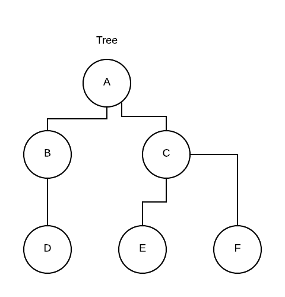

And this is also a tree:

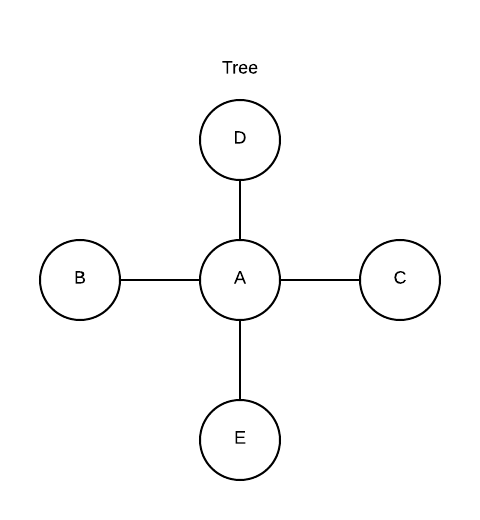

Tree's have **exactly** one path between two vertices. You cannot have more than one path between any 2 vertices.

The number of paths that lead into and out of a vertex is called the __degree__ of a vertex.

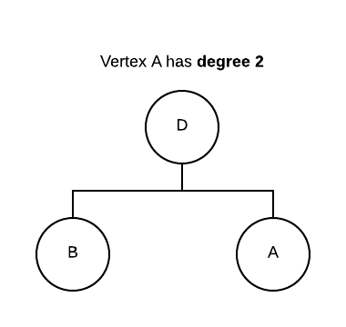

A __cycle__ is where you can "Move all the way around". Notice the vertices y, u, and v. You can "move all the way around" these 3 vertices. **Acyclic** means there is no cycle in the graph. If it is Acylic it implies it is a tree.

If it has more than 2 paths from 1 vertex to another or it has a cycle then it is not a tree.

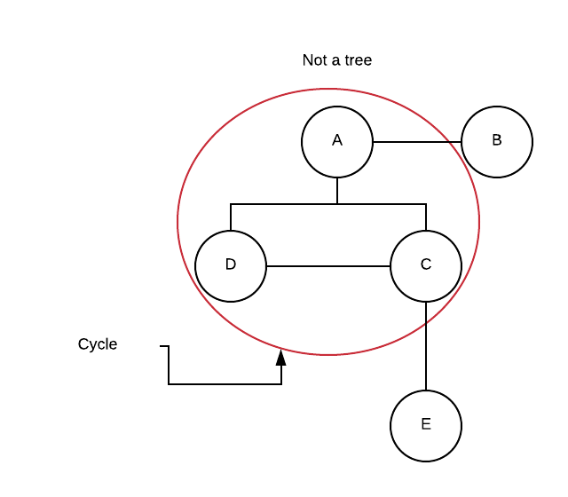

A tree is often used to represent something that has a hierarchical sturcture, such as files and folders in a desktop.

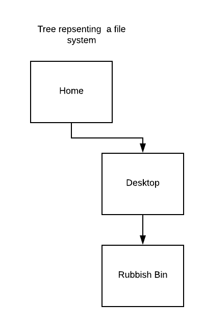

A **rooted tree** has a direction where it goes from the top to the bottom but in some cases we can have an **unrooted** tree where it is not drawn top to bottom.

The topmost vertex is called the **root** of the tree. Where it all comes from.

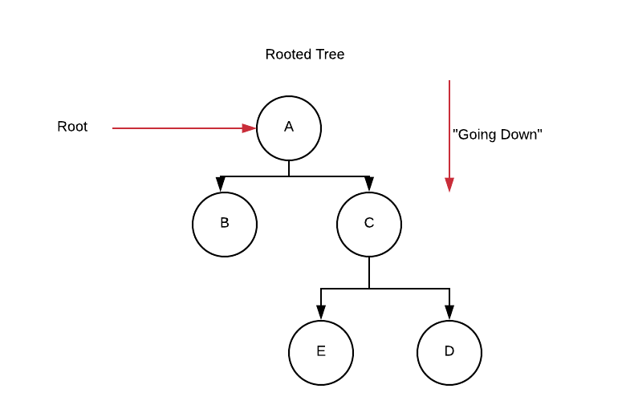

A vertex might have **children** below it, connecting to the vertex. In this case we say the ones below it are the **children / child** and the original vertex is the **parent** of the vertex.

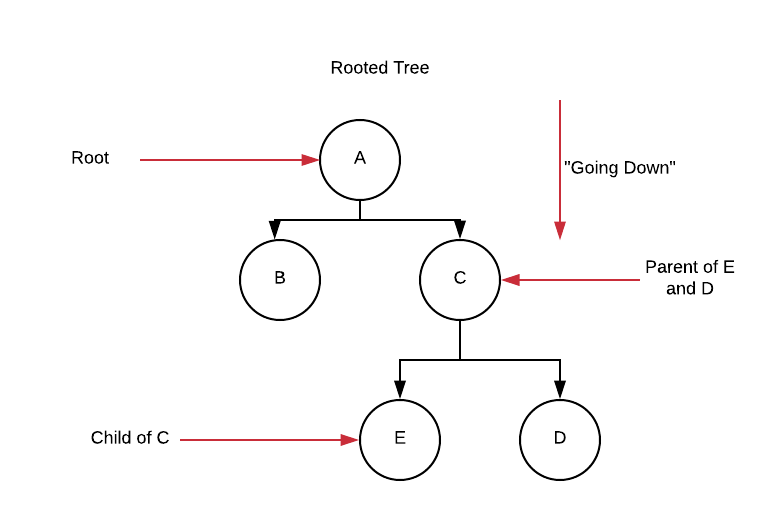

In a **rooted tree** there is an implicit direction of the tree that is often not drawn in rooted trees, usually it goes downwards.

The **degree of a vertex** is the number of children it has.

The **degree of a tree** is the max degree from a vertex in the tree. So if a vertex has a degree of 3 and no other vertex has a degree higher than 3 then the degree of the tree is 3.

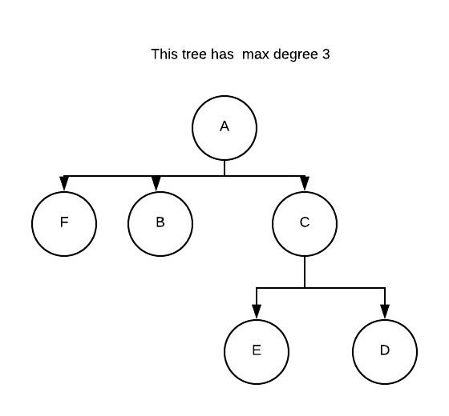

A vertex with no children (degree 0) is called a **leaf**.

Vertices other than leaves / roots are called **internal vertices**. These are sometimes called downward branches in a **rooted tree**.

A **subtree** is a tree that comes from a vertex that isn't the **root** vertex. You can have a subtree of a subtree.

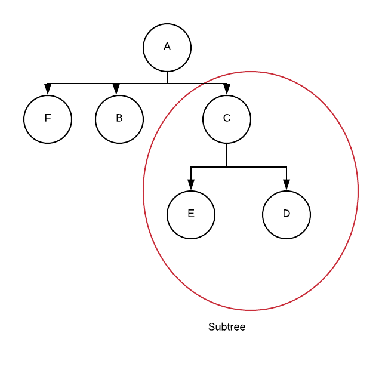

Any vertex can be considered a sub-tree with 1 single leaf in it.

## Binary Tree

A binary tree has a degree of most 2. No vertex has a degree higher than 2. The two subtrees are called the left subtree and the right subtree.

The left hand side tree is smaller, the right hand side tree is larger. This is a really cool feature of binary trees. Binary trees are based off of comparisons. Is one number bigger than another number?

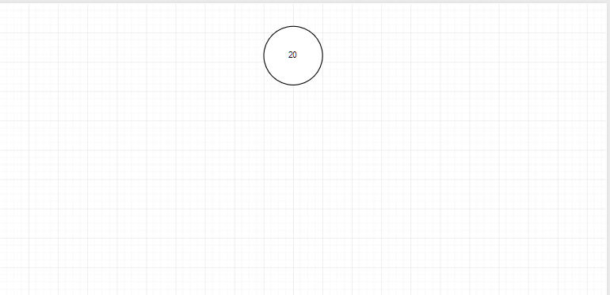

We start off with the root node, which in this case is 20. Let's say we wanted to insert the numbers 10 and 3 into the tree. 3 is less than 10 so it goes on the left hand side.

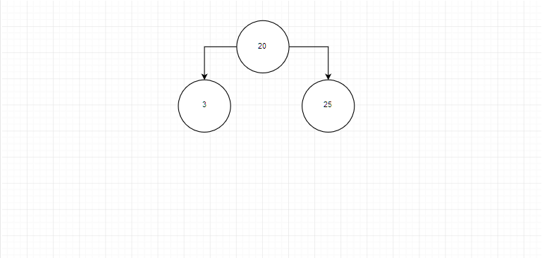

Now we inset a few mode nodes for some data. Smallest of the 2 compared always goes left, largest always goes right.

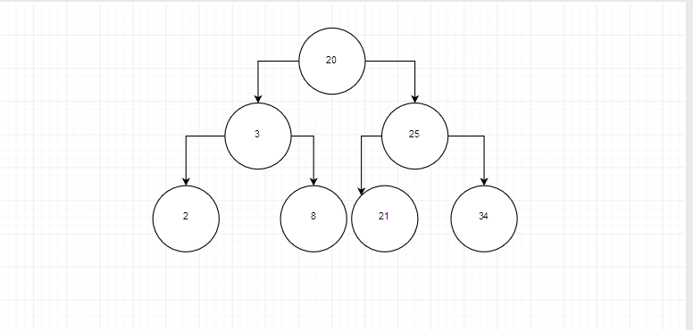

Now what if we wanted to find the number 8?

Start off at 20. Is 8 larger than 20? No. So it's not on the right hand side. We just halved the entire tree. We don't need to check the right hand side **at all** in order to find out if 8 is in the tree. Okay, so is 8 larger than 3? Yes it is - so 8 must be on the right subtree.

And yes, we found 8! So easy and fast!

You can traverse binary trees using these 3 algorithms, but note that these only work on binary trees because we need to have a "left" subtree and a "right" subtree.

### Pre-order Traversal

A pre-order traversal method visits the left subtree first, then the left and right subtrees of that subtree the right and then eventually the right subtree. It tries to go down as far left as possible and stick to the left hand side as much as possible.


Gif from [here](http://108.61.119.12/wp-content/uploads/2014/10/binary-tree-1-pre-order.gif).

### In-order Traversal

The left subtree is visited first, then the root vertex and then the right sub-tree is visited.


Image from [here](https://www.tutorialspoint.com/data_structures_algorithms/tree_traversal.htm)

In-order traversal gives us numbers in ascending order, which is a really cool feature of this traversal.

### Post-order Traversal

We first traverse the left subtree, and then the right subtree, and then finally the root node. The root node is visited **last**. 


Image from [here](https://www.tutorialspoint.com/data_structures_algorithms/tree_traversal.htm)

https://www.youtube.com/watch?v=GJ9rSCZsTEw

### What if you forget which one's which?

Luckily there's this "dot" notation you can use!


So, firstly you need to know these dot positions. They'll come in handy in a second!

So let's say you want to find the the pre-order traversal, you put the dot to the left of the node like in the picture above.

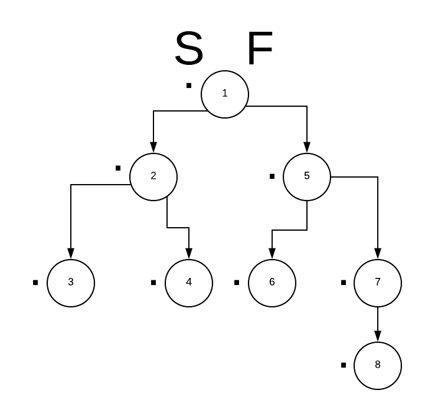

Then you write S on the left hand side of the root node and F on the right hand side of the root node.

Now you simply draw a line from S to F

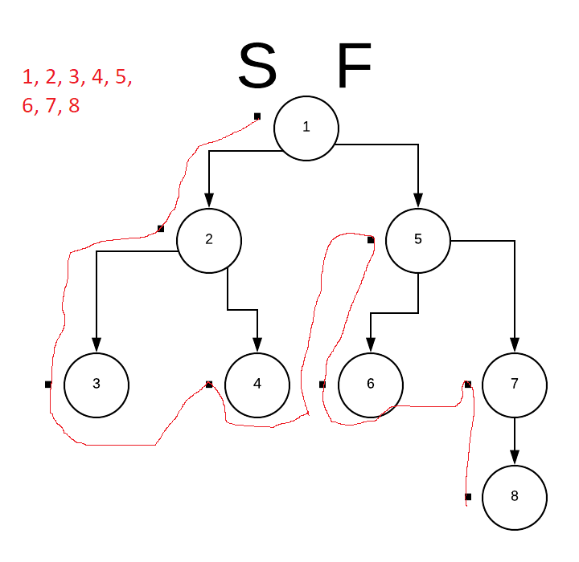

Try not to go back on yourself. We could of gone to 6 and then 5, but that would of made a mess and it would be hard for us to go back on ourselves without the lines looklikg like they touch.

## Expression Trees


A mathematical expression can be expressed as a tree like so.

In fix notation is written as:

$$ (2 + 5 * 4) * 3$$

This is what we normally use. The operator (addition, multiplication) is **in** the expression.

Postfix notation looks like:

$$ 2 \space 5 \space 4 * + 3 * $$

We can use post-fix traversal to get the postfix notational representation of equations.

The operator is at the end of the expression it is evaluating. Computers often use this notation more than in-fix notation.

If we look at the in order traversal for the expression tree we get the in fix notation. If we want to get the post fix we need to use post order traversal.

# Eviction Algorithms

Let's say you have a slow hard drive, k, which contains the following data:

$$ k = [4, 5, 3, 7, 9, 4] $$

And you have a faster memory storage, called a __cache__, n, that has the rule n < k and n is a subset of k. So in other words, the cache can never be the same size as the hard drive or larger than the hard drive and all items in the cache must be in the hard drive. So we can have a cache like this:

$$ n = [4, 5, 3, 7] $$

And then in this instance we can say that cache can only hold 4 items.

What if we wanted to add another item to the cache? What if we use the number "5" a lot? 

We would want to **evict** something from the cache in order to allow us to put another item into the cache.

A **hit** is what happens when a user requests data and it is in the cache. A **miss** is what happens when the data isn't in the cache.

## No Eviction

The easiest algorithm would be to not evict any data at all. This is bad because that means that the data in the cache will stay that way forever. But obviously humans over time evole, what if we **never** use the number "4" but we always use another number? Well, luckily there are algorithms that actually evict things!

## Evict Largest

This eviction algorithm goes through the array and evicts the number that is the largest of all of them. This is where the min / max algorithm seen earlier comes into play. Once we find the largest number in the list, which for n is 7, we evict it and we insert something new into it.

Here we insert the miss, the item that wasn't in the cache when the user requested it, into the cache.

## Evict First in First Out

This algorithm reads the cache and the first item put into the cache is the first one evicted.

If we have the cache:

$$ n = [4, 5, 3, 7] $$

And we want to insert a missed item, 31, into the cache we will remove the first item from the cache and replace it with 31 like so:

$$ n = [31, 5, 3, 7] $$

This is where it changes every so slightly! Instead of always sticking with the first in first out principle, we ignore 31 and go onto the next number. If we always remove the first one, we would just only change the first item. We need a "head" variable which always points to the first (but not inserted into) item in the cache.

So the head would first point at array index 0, then array index 1, then array index 2.

## Least Frequently Used

This cache makes the most sense, but take's a lot to implement. The item in the cache that is least frequently used is evicted from the cache.

There are 2 main methods to implement this. The first is using a dictionary, hash, hashmap, map, any data structure that has a key : definition style.

I prefer calling it a dictionary, as it looks like a dictionary. You have a definition and you have the meaning of the definition. A dictionary entry may look like:

```
Love

lʌv
noun

a strong feeling of affection.
```

The important part here are these parts:

```
definition: Love
Description: A strong feeling of affection.
```

This can be expressed in Python as:

```python
a = {"Love" : "A strong feeling of affection."}
```

So we can build a cache, like this:

```python
a = {31: 1, 5: 1, 3: 1, 7: 1}
```

Where every definition starts out with a descrption which is how many times it has been searched of "1".

Now whenever the user makes a request to the cache and the item is in the cache we increment it by 1. So if the user wanted 5, we would do:

```python
a = {31: 1, 5: 2, 3: 1, 7: 1}
```

What if the user requests something that isn't in the cache, like 6?

Well what we have to do is evict the item with the lowest number of requests. However in this example 3 items have the same number of hits, 1. So what we do is we just evict the left-most item.

```python
a = {6: 1, 5: 2, 3: 1, 7: 1}
```

If the user requests 31 again, it just places it back into the dicitonary with a value of 1.

Another way to do this is to have 2 lists (arrays) both of length n. The first list contains the data and the second list contain the hit counters. It would look something like this:

```python
a = [6, 5, 3, 7]
b = [1, 2, 1, 1]
```

# Graph and Graph Theory

If you want to learn **a lot** about Graph Theory, check out this [article](https://medium.freecodecamp.org/i-dont-understand-graph-theory-1c96572a1401)

The seven bridges of Koenigsberg is the foundation and birth of graph theory.


There was a puzzle that stated:

> Can you cross all seven bridges exactly once?


There are 2 rules for this problem:

1. Do not cross any bridge twice
2. All bridges must be crossed


In the 18th Century a mathematician called Euler realised this problem was impossible. Every bit of land you enter has to have 2 bridges, or an even number of bridges. One you can leave on, one you can enter on.

You'll notice a part of the land does not have an even number of bridges, it actually has 3 bridges. 

Let's move straight into graph theory.

An __undirected__ graph G = (V, E) consists of a set of vertices V and a set of edges. It is an undirected graph because the edges do not have any direction. 

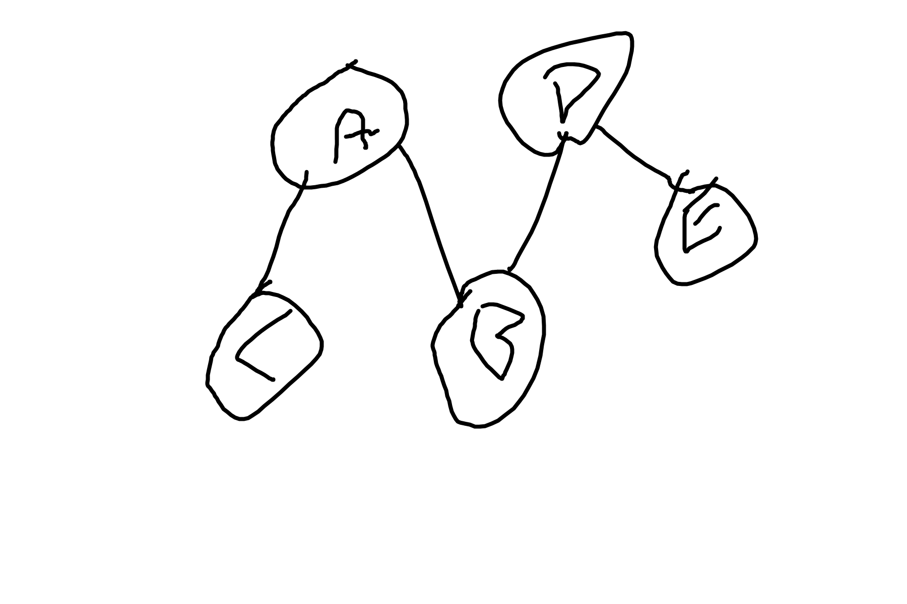

Each edge is an unordered pair of vertices. So {a, b} is the same as {b, a}.

A __directed__ graph G = (V, E) is where each vertex has a direction.

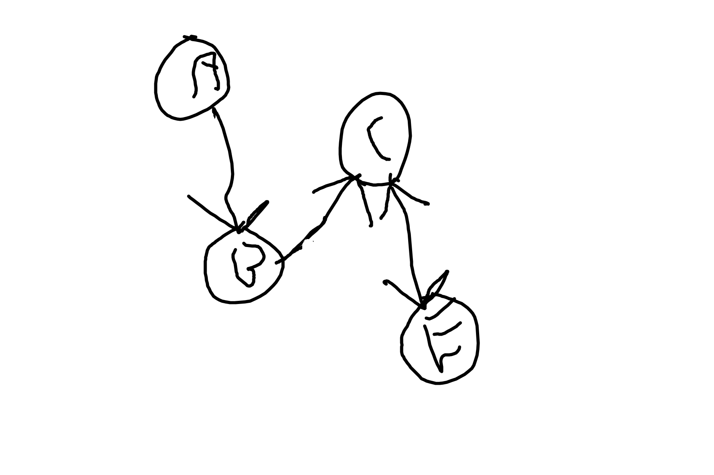

Think of it like Facebook and Twitter. On Facebook when you friend someone, the other person is automatically a friend of you. 


image from [here](https://www.safaribooksonline.com/library/view/mining-the-social/9781449368180/ch02.html)

Graphs are used to model computer networks, state spaces of finite games such as Chess.

Here are some of the different types of graphs:

**Simple Graph**

The Simple Graph has at most 1 edge between 2 vertices and it has no self-loop. It has no edges that come from a vertex and go back to that same vertex.

This is **not** a simple graph:

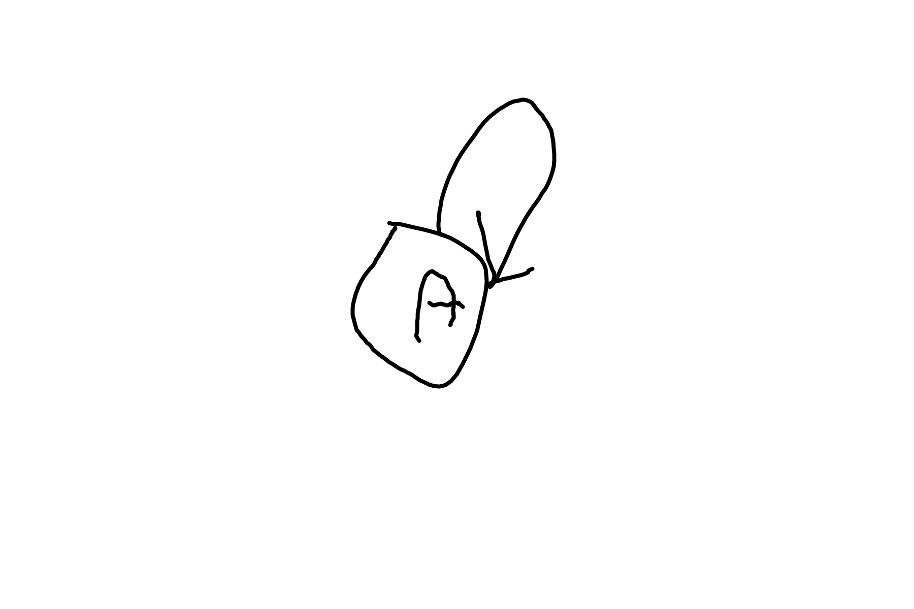

And this is not a simple graph, because a vertex exists with no edges connecting to it:

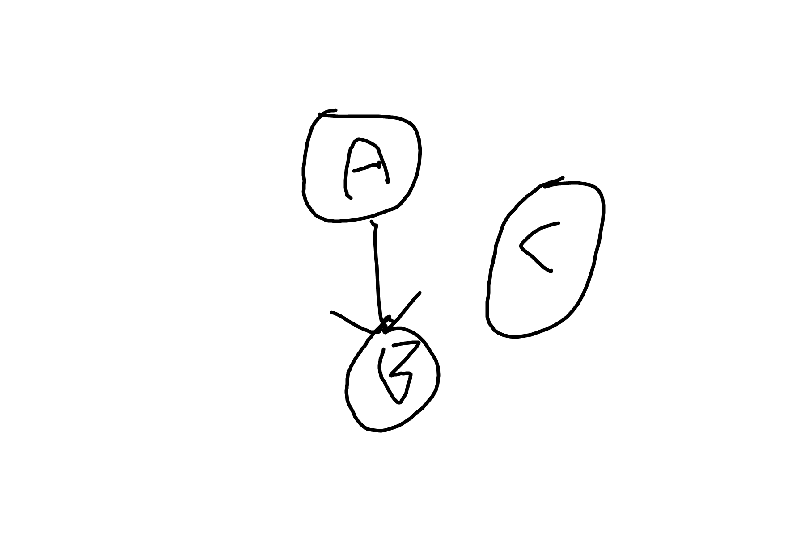

This is a simple graph:

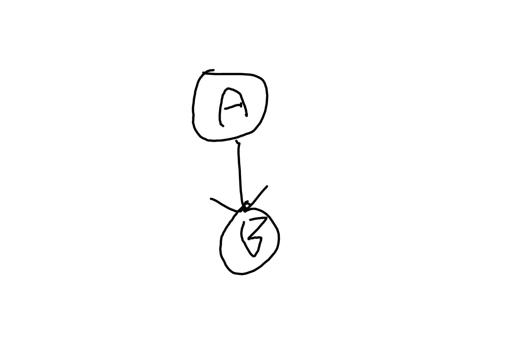

**Multi Graph**

A multi graph allows more than one edge between two vertices:

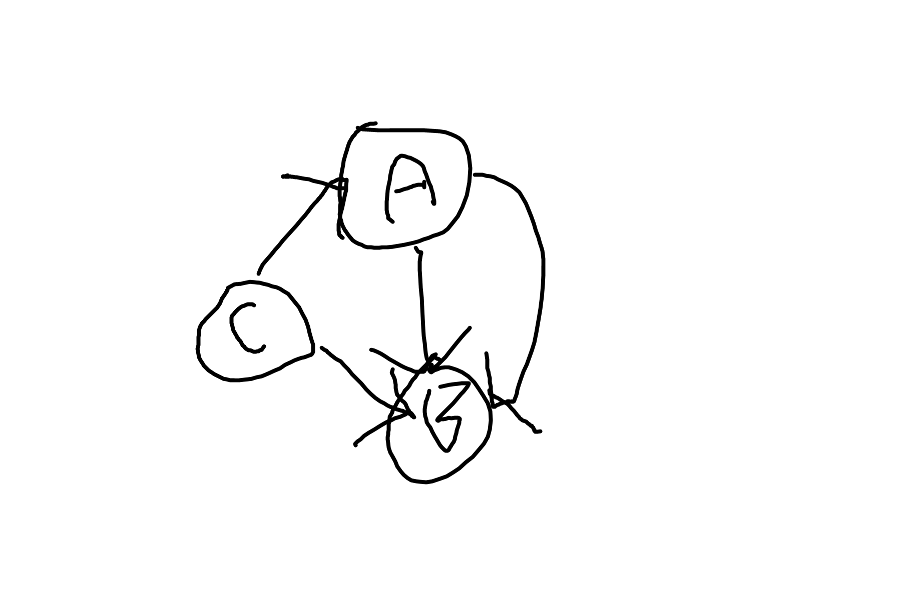

## More on Undirected Graphs and Terminology

In an undirected graph, G, suppose that e = {u, v} is an edge of G

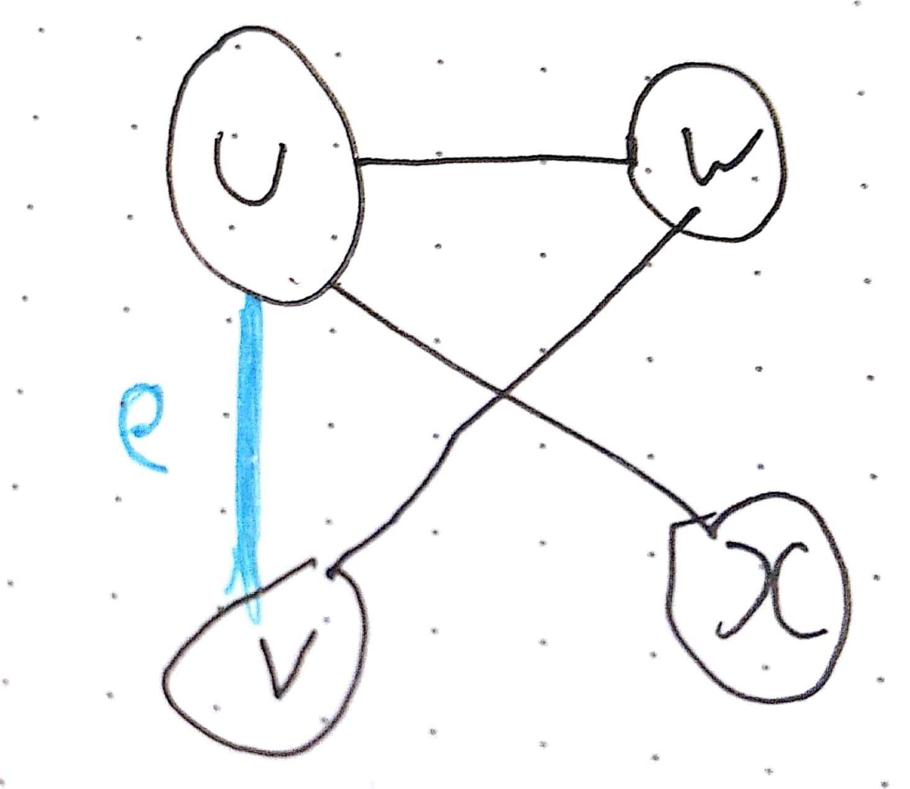

u and v are said to be __adjacent__ and are called __neighbours__ of each other

e is said to be __incident__ with u and v

u and v are called __endpoints__ of e

e is said to __connect__ u and v

The degree of a vertex is how many edges are connected to it.

The degree of the graph is the maximum edges connected to a particular vertex. In this graph the degree is 3, since vertex u has degree 3 and is the largest degree in the graph.

## Matrix Representation of Graphs

An undirected graph can be represented by an adjacency matrix.

A matrix is like a vector or a set, it's a storage unit to store numbers in it.

An __adjacency matrix__, M, for a simple undirected graph with n vertices is called an __n x n matrix__.

In this matrix if vertex i and vertex j are adjacent (neighbours) then you can represent this on the matrix with the number 1.

If they are not, use the number 0.

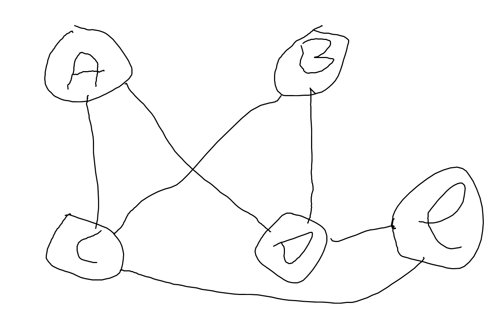

To represent this in a matrix, we can do the following:

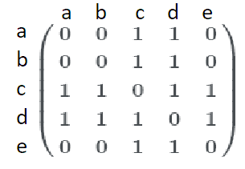

Notice how the diagonal is 0's and if you take half of the upper triangle it matches the bottom half.
<br>

An __incident matrix__ is an m x n matrix where m is the number of edges in the graph.

For this graph again:


We can use this incidence matrix to represent it:


## More on Directed Graphs

An __in-degree__ of a vertex, v, is the number of edges leading to v.

An __out-degree__ of a vertex, v, is the number of edges leading away from v.

The __in-degree__ is the same as the __out-degree__. It's also the same as the number of edges.

$$ in \space degree \space sum = out \space degree \space sum = number \space of \space edges$$

A directed graph can be represented by an adjacency matrix or an incidence matrix.

### Adjacency Matrix

An __adjacency matrix__, M, for a directed graph with n vertices is called an n x n matrix.

* M(i, j) is equal to 1 if (i, j) has an edge from i to j
* M(i, j) is otherwise 0.

An __adjacency list__ is where each vertex, u, has a list of vertices pointed to by an edge leading away from u.

This is really nothing different from what we saw earlier.

### Incidence Matrix

An __incidence matrix__ for a directed graph with n vertices and m edges is an m x n matrix.

These are the basic rules:

* M(i, j) = 1 if edge i is leading away from vertex j (leaving)
* M(i, j) = -1 if edge i is leading to vertex j (into)
* M(i, j) = 0 otherwise

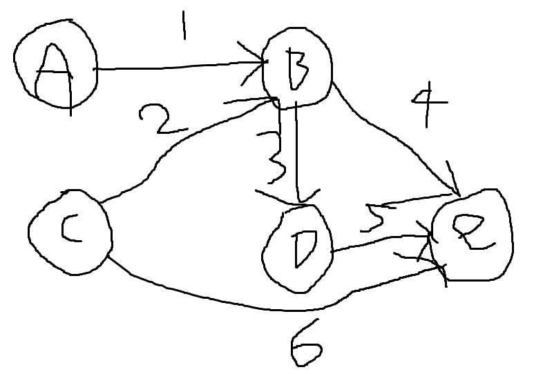


__Incidence list__ is a list where each vertex, u, has a list of vertices pointed to by an edge leading away from u.

## Circuits

A circuit, a path, a cycle are all sequences of vertices and edges.

They all have rules and properties which make them special, these are:

* Cycle: Vertices cannot repeat. Edges cannot repeat.
* Walk: Vertices may repeat. Edges may repeat.
* Circuit: Vertices may repeat. Edges cannot repeat.

Normally a circuit is defined as a path from vertex a, back to vertex a.

A __simple__ circuit visits an edge at most once (so never goes back to the same vertex).

An __Euler circuit__ is a circuit visiting every edge exactly once (so can go back to the same vertex).

This is the exact same circuit Euler wanted to create on the Kronenbeig problem earlier. To cross every bridge (edge) exactly once, but allowing you to go to the vertexes (islands) as many times as you want.

An __Hamiltonian circuit__ (not named after Alexandria Hamilton) is a circuit containing **every vertex** of a graph, G, exactly once.

It does not matter in a Hamiltonian circuit whether or not you visit all of the edges.

Determining whether a graph contains a Hamiltonian circuit is an NP-hard problem. For information on NP-hardness click [here](https://stackoverflow.com/questions/1857244/what-are-the-differences-between-np-np-complete-and-np-hard).

# Searching on Trees / Graphs

Okay, so we've met trees and graphs. But how do we search them? We can use some of these nifty search algorithms!

## Breadth First Search

Breadth First Search (BFS) is a search algorithm developed by Konrad Zeus for his rejected PhD thesis in 1945. Breadth First Search searches all neighbours before it searches child nodes. In the below picture, once the start state (1) has been searched the states 2, 3, and 4 will then be searched.


The Breadth First Search Algorithm has a queue which is vital to how it works. Breadth first will first check whether the current node it is searching is the goal state or not. If it is not the goal state, it places all child nodes of the current node being searched into a queue. As an example assume the queue will look like [5, 6, 3, 4].

Because of the first in first out nature, the first ones added to the queue are the first ones out of the queue, so it would search in the order 4, 3, 6, 5.

Breadth first search searches in "levels". It starts at level 1, [1], then goes down to level 2, [1:2, 1:3, 1:4].


When we look at a neighbour we need to see if it's neighbours have been visited yet. In order to do this we need to "mark" the vertex to signify we haven't looked at it yet.

### Advantages

Breadth-first search is complete, as in it will always find a path and the shortest path to the goal, assuming the goal is at a finite depth.

### Space and Time Complexity - A Quick Detour

Time complexity is how long it takes the algorithm to run given an input, usually denoted in Big O notation. Space complexity is how much the algorithm takes up in memory. Although this depends on the hardware factors, just like with Big O notation we can use a notation to represent how much space it’ll take up.

Consider a theoretical tree where node state has b successors. The root of the search tree generates b nodes and the second level of the search tree generates b² nodes. Each level generates b more nodes, yielding b^n (b to the power of n) nodes where n is the level the search tree is on. So the __time complexity__ is $$b^n$$.

The __space complexity__ of this is $$b^d$$.

You may notice this looks different from Big O notation, well, for some reason a lot of AI researchers use this notation. In big O the space and time complexity is:

$$ O(|v|)$$

Where \|v\| is the number of nodes.

I believe this notation is used because it is the notation used in the book "Artificial Intelligence: A Modern Approach" by Russel and Norvig and because this book is **the** book on Artificial Intelligence everyone uses their notation.

**b** is the branching factor of the tree.
**d** is the shallowest goal node (the lowest level at which a node is a goal for a given search problem)
**m** is the maximum length of any path in the state space.

### Disadvantages

Breadth First Search is very, very slow and requires a lot of memory, however, on a smaller graph / tree it is efficient.

## Depth First Search

Depth First Search expands the deepest node in the current frontier first. Depth first search goes immediately to the deepest possible point of the search tree until there are no sucessors.


In this example, Depth First Search will go straight to 9, then 10 and then to 6.

Whereas Breadth First search uses a first in first out (FIFO) queue Depth First uses a a Last in Last out queue (LIFO). A LIFO queue means that the most recently generated node is chosen for expansion. The most recently generated node must be the deepest possible unexpanded node because it is deeper than its parent node.

If Depth First Search is used on a graph which avoids repeated states and redundant paths then it will find its goal in a finite number of states. If however it is used on a search tree then it will expand forever, in other words depth first search is not complete within search trees.

Depth first search will not find the optimal path.

The time complexity of DFS is 1+ b² + b³ + … +b^m

The advantage of DFS over BFS is the space complexity. Once a path has been fully explored it can be removed from memory, so DFS only needs to store the root node, all the children of the root node and where it currently is. DFS requires space complexity of bm where b is the branching factor and m is the longest path in the graph.


## Uniform Cost Search


Uniform Cost search is Dijkstra's Algorithm but rather than finding the single shortest path to every point in the search tree it finds the single shortest path to the goal node.

Breathed first search is only optimal when all steps cost the same, because it always expands the shallowest unexpanded node. With a simple extension to breadth first search we can create an algorithm that is optimal for any cost. Instead of expanding the shallowest node like with BFS it instead expands the node, n, with the **lowest path cost**.

If all steps cost the same then Uniform Cost Search is identical to BFS.

Uniform cost search does not care about the number of steps a path has but instead it cares about their total cost. Therefore it is possible for BFS and Uniform Cost Search to get stuck in an infinite loop if it ever expands a node that has zero-cost leading back to the same state.

In other words, if Uniform Cost Search expands into a node with a cost path of zero from a node with a cost path of zero and there are two routes to each other it can get stuck in an infinite loop.

We can guarantee completeness using this search method by making sure the cost of every step is greater than or equal to a small positive constant.

Uniform Cost Search is guided by path costs and not lengths so it’s complexity cannot easily be shown. Instead, let X be the cost of the optimal solution and assume that every action costs at least Y. Then the algorithms worst case scenario is O(b[X/Y]) which can be much greater than B^d, which makes Uniform Cost Search slower and more resource hungry than Breadth First Search.


## Depth Limited Search

Depth Limited Search is a variation on DFS whereby a limit is set to the depth of DFS so it does not go on forever or too long. It also solves the infinite path problem.

If the goal is at level N and we choose a depth of D and D < N then Depth Limited Search is incomplete.

The solution found is not guaranteed to be the shortest optimal path.

The time complexity of Depth Limited Search is B^d where d is the depth limit.

The space complexity of depth limited search is B*d where d is the depth limit.

## Iterative Deepening

Iterative deepening is a variation on Depth Limited Search whereby the depth limit is increased if the goal is not found. Iterative Deepening often starts at level 0 and then increases by a singular level if the goal isn't found on that level.

Iterative Deepening Depth First Search combines the best parts of depth-first search and breadth first search.

Iterative Deepening's memory requirements are small, O(bd) where b is the amount of nodes generated and d is the depth level.

Iterative deepening may seem wasteful because nodes are generated multiple times, although this is not very costly. Consider a search tree with the same branching factor at each level; most of the nodes will be on the bottom level so it does not matter much to generate upper level nodes repeatedly.

In iterative deepening, nodes on the bottom level are generated once, those on the next to bottom level are generated twice and so on up to the children of the root node, which are generated d times.

## Bidirectional Search

The idea of bidirectional search is to run two searches, one forward from the start state and one backward from the goal state, stopping when the two searches meet. The idea is that b^d/2 + b^d/2 is much smaller than b^d.

Bidirectional search works by having one or both of the searches check the next node to see if it is in the fringe (frontier) of the other search tree, if it is then a solution has been found.

The time complexity of Bidirectional search is O(B^d/2)

Bidirectional search must be able to calculate the predecessors of states and must also know where the goal is.

## Informed Heuristic Searches

An informed search strategy is one that uses problem-specific knowledge to find solutions more efficiently than an uninformed search strategy.

### Greedy Best-First Search

Greedy attempts to expand the node that is closet to the goal on the idea that it is likely to lead to a solution quickly.

It uses heuristics to determine which nodes are ‘closet’ to the goal node.

Greedy search is like depth first search in that it prefers to take a singular route to the goal and will back up when it hits a dead end. Greedy search is not optimal and it is incomplete because it can get stuck within an infinite loop.

The worst case time complexity of greedy search is O(b^m) where b is the amount of nodes and m is the maximum depth of the search space.

### A* Search

The most widely known form of search algorithm is A* (a-star). It chooses its path based on 2 statistics, g(n) and h(n). g(n) is the cost to reach the node and h(n) is the heuristic function that shows the cost from the node to the goal.

f(n) = g(n) + h(n)

Provided that the heuristic function satisfies certain conditions then A* is both optimal and complete.

A* is optimal if h(n) is an admissible heuristic. That is provided that h(n) does not over estimate the cost to reach the goal. Admissible heuristics are often optimistic as they think the cost of solving the problem is less than it actually is. Since g(n) is the exact cost to reach n, we have an immedtiate consequence that f(n) never overestimates the true cost of a solution through n.

A* is normally not suitable for large search problems.

It also makes for some really cool YouTube videos:

https://www.youtube.com/watch?v=J-ilgA_XNI0

## Games as Search Problems

In traditional search algorithms the user makes all the moves, however in a game we implement search algorithms against an unpredictable enemy.

The best possible way is to calculate every single possible move the enemy can make and counter them, although this will cause a combinatorial explosion in which the computer will take too long to calculate the correct answer.

In reality, we need to use heuristics to calculate search problems in games.

In some games we have a fully observable environment, we know everything about the environment such as Chess or Go. In other games we have partial information where we don't fully know the environment, such as Poker.

### Minimax Algorithm

In a game, Min and Max are two players. Max wants to win (maximise the utility of each move) whereas Min wants Max to lose (minimise utility for max).

The game Minimax is used on has to be a zero sum game, that means that there can only be winners and losers, nothing in between; like Chess.

The set of goal states is replaced by a utility function.

Max wants a strategy for maximising utility assuming min will do the best it can to minimise max’s utility.

The utility of a MAX-state (where Max moves) is the maximum of the utilities of its successor states.

The utility of a MIN-state (where Min moves) is the maximum of the utilities of its successor state.


The Minimax starts from the bottom, with Min (player 1) starting first. You know min starts first because it is denoted in the left hand side. Min would choose the lowest possible value, so for level 1 it would be {4, 5, 2} since these are the lowest possible values in the tree.

We then move one level up. The Minimax values of A is the maximum value of {4, 5, 2} which is 5. So Max would choose 5.

In game playing, minimum would want Max to choose the one with the lowest utility, as a higher utility might attack or hurt player 1 more than a lower utility.

In a game such as chess the trees are extremely large. In chess the number of moves grow exponentially, after 4 moves there are 288 billion different possible positions. This is where Alpha-Beta pruning comes in. We cut off large chunks of the tree that we believe we no longer need in order to allow the Minimax algorithm to run in efficient time, that is time that will take less than 10 minutes to run (roughly).

Minimax tries to reduce the maximum damage the opponent can do whilst reaping the maximum possible reward for us assuming the opponent plays optimally.

There is also a second list, a list of every node that has already been visited in the search tree.

If you want to learn more about adveriseral game play I highly recommend this lecture from MIT:

https://www.youtube.com/watch?v=STjW3eH0Cik

# Greedy Algorithms

It's best to show how a Greedy algorithm works with an example.

Let's say we have 3 coins:

10p


20p


50p


What is the minimum number of coins needed to make 80p, £1, or £1.40?

Sure, we could make 80p with 8 10p coins but we want to find a way to do it with the least number of coins, one of the solutions are: 10p + 20p + 50p.

The idea is for every step try to make the best move you can make and keep going until you're done.

Let's say we have an **undirected connected** graph, G, which has edges that are labelled by weight.

This is a weighted graph:


A **spanning tree** of G is a tree containing all vertices in G.

A **minimum spanning tree** is a spanning tree of G with minimum weight.

If we have a tree with n vertexes, the number of edges connecting all the vertexes are n - 1. The number of possible spanning trees is:

$$ {number \: of \: spanning \: trees} = { {number \: of \: edges}\choose{number \: of \: vertices-1} }$$


## Kruskal's Algorithm

https://www.youtube.com/watch?v=71UQH7Pr9kU

Kruskal's algorithm let's us find the minimum spanning tree of a graph.

First we sort the edges, so the smallest weighted edge is first.

We then choose the edge with the least weight, and then we continue adding the smallest weight. If we form a cycle, don't include that edge.

Let's say we have a graph like so:


How would we go around finding the minimum spanning tree?

Before you say it, yes I have bad hand writing. Should I be ashemed of having bad handwriting? Nope. Don't worry. If anything looks unreadable I'm going to write it out here so it's readable for you. Just understand that to be a computer scientist you absolutely do not need to have handwriting other people can read, as we have computers to make readable handwriting for us.

We first must order all the edges from smallest to largest like so:

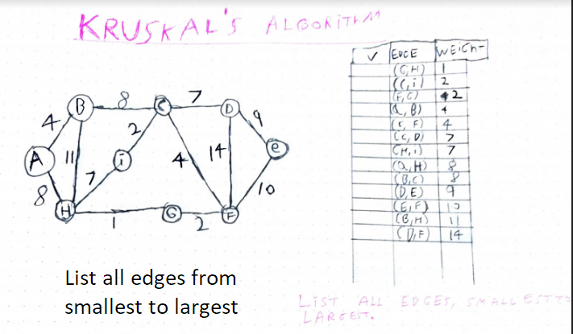

To save your eyes some strain, here's the edges in a nice table:

Done? | Edge | Weight
--- | --- | ---
 | (G, H) | 1
 | (C, I) | 2
 | (F, G) | 2
 | (A, B) | 4
 | (C, F) | 4
 | (C, D) | 7
 | (H, I) | 7
 | (A, H) | 8
 | (B, C) | 8
 | (D, E) | 9
 | (E, F) | 10
 | (B, H) | 11
 | (D, F) | 14

Now we colour in (or choose) the smallest edge. How do we know what's the smallest edge? We just give the table we made.


And the next one


You can skip a few of these, i'll write **STOP!!!!** when something interesting happens.

Next one...


If you take your time to look at every image of this graph, highlight this!
PS: this edge is "4" not "14".


Now the next one to highlight is (H,I).
**STOPPPP!!!!!!!!!!!!!!!**

(H, I)? But that makes a triangle. You can go all around the triangle. Wait, is this a cycle? Yes it is! 

See how easy it is to recognise when a cycle happens as a human? As a computer, it's a lot harder. You can't just tell it to "see" and "guess" where a cycle will be formed. We'll come back to this topic later, but for now we'll skip (H, I).

Look, if we add (H, I) we get a cycle!


So let's not do that.
Now we just need to add (A, H)


If we want to add (B, C) the next smallest edge we will make a cycle so let's not do that.


We can't include (E, F) as it's a cycle. So let's skip that.
Actually, we can't include any of the remaining edges, since they all form a cycle. So now we have a minimum spanning tree.
It's really quite a simple and greedy algorithm to find a minimum spanning tree of a graph.


Here's a nice gif!

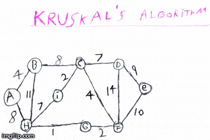

Okay, back to detecting cycles. Let's say you want to insert the edge (E, V) into the minimum spanning tree. We need to check to see if it is possible to get from V, to E, so a path exists from (V, E). 

This sounds confusing, so let's look at this picture again.


So we want to insert edge (H, I). To do that we need to see if a path exists which takes us from I to H already without the added edge. We can see that the path:
I > C > F > G > H
is a path from I to H. Because this path exists, we cannot add the edge as it would form a cycle.

You can use any of the searches above such as Breadth First Search or DFS to find this path.

You could also check the ancestors of the graph if it is a directed graph. You can navigate up until you find a parent node that is equal to the end of the edge you are wanting to add.

There is lots of ways you could do this.

### Dijkstra's Algorithm

Dijstra's algorithm finds the shortest path from one node to every other node in the graph.

Dijkstra's algorithm assumes that the weights of the edges are not negative.

The main concept of this algorithm is to choose the edge adjacent to the chosen vertex such that the cost of the path to the vertex is minimum.

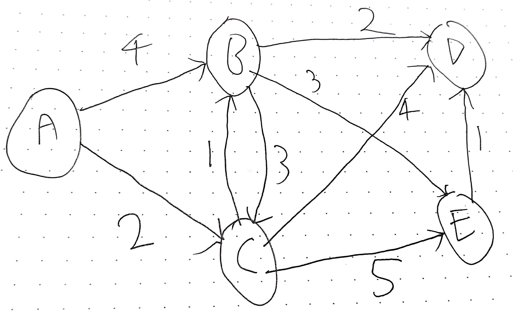

So we start off with a weighted graph. Let's choose A as our starting node.

We will keep a list of all unvisited nodes as well as the path cost for every node counting from A. The path from A to A is 0, so we write 0.

We don't know the path cost of the other nodes yet, so we write infinity.

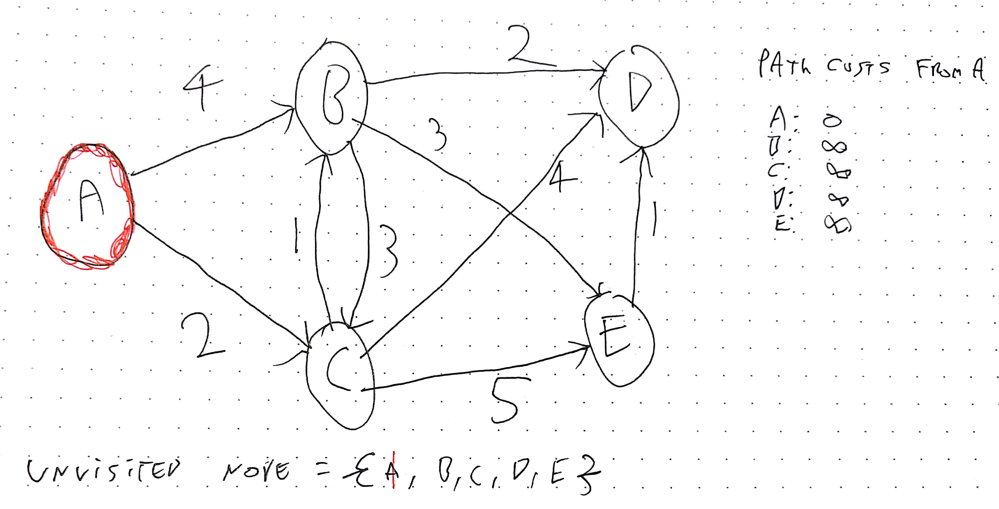

The next step is to find all the edges we can reach from A. We can reach B and C from A, so we update the table with the correct costs.

Because C is the cheapest vertex that hasn't been visited yet, we choose C.

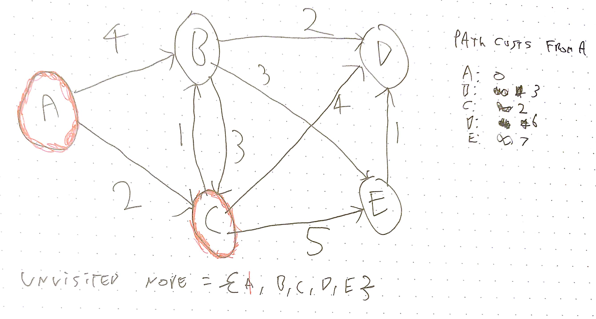

It only costs 3 to go from A>C>B instead of the higher A>B which costs 4 - so we write 3 in B now.

Now we read from our list of paths, which one is the cheapest? A>C is but we've been there (as our unvisited nodes says). We haven't been to B yet and it's the second cheapest, so we go there.

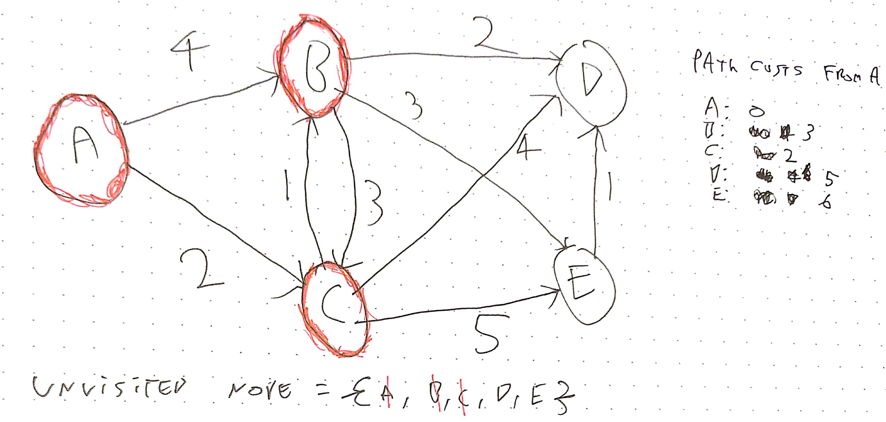

We finish up C using the same algorithm as before. Now we pick somewhere to go. D is cheap, so let's go there. Normally we would read all of the edges connecting D to other nodes, but D does not have any edges connecting it to other nodes. Only edges connecting other nodes to D (directed graph, remember?).

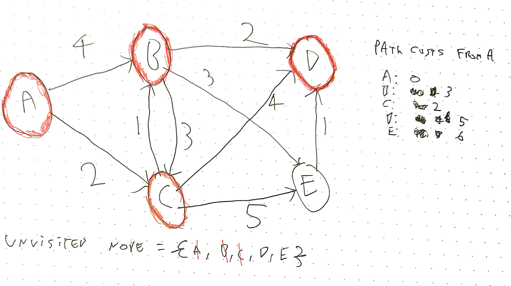

Now the only node left is E, and we can't get there from D. So we move backwards until we find a point where we can move to E. We can go from B to E, so let's do that.

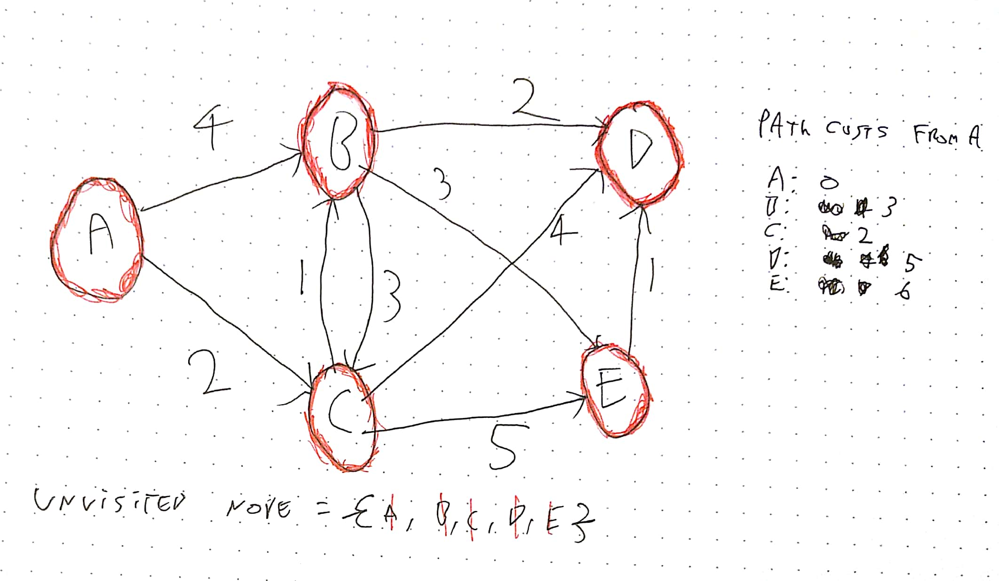

Now we have no more nodes to visit. We know this because our unvisited node list is now empty (all nodes are visited).

You may look at this algorithm and think "wow, this only works on graphs where we know what nodes are on it?". Nope. It'll work on any graph that is weighted and has nodes on it. Instead of having an unvisited list, we can have a visited list to prevent us from going back to the same place.

To know when the algorithm is completed when using a visited list, when you're at a node and all of the edges connecting that node have been visited then you can assume that you have visited every node. You may run across a problem of finding a node and not visiting it and being stuck never having visited that node. In this case, keep a list of all nodes you've seen but not yet visited.

This is what every single path to every single node from A looks like:

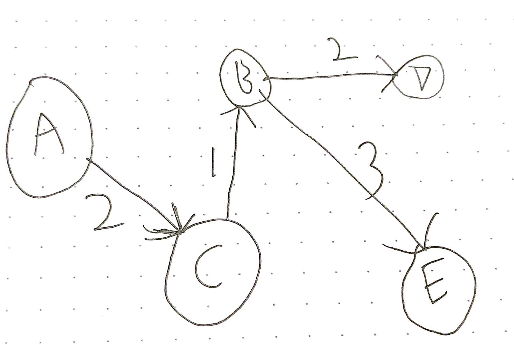


Dijkstra's algorithm is easy once you understand that it always chooses the path that is cheapest.

I highly recommend this article from Vaidelhi for some extra learning:

https://medium.com/basecs/finding-the-shortest-path-with-a-little-help-from-dijkstra-613149fbdc8e

Dijkstra's algorithm is super cool. Ever wanted to know how your SatNav finds the fastest route from your home to somewhere? It uses this algorithm. Well, their algorithm is probably slightly modified. But it's the same principles!

#### Psuedocode

To describe the algorithm using psuedo code we need to give some notations first:

Each vertex, V, is labelled with two labels:
- A numeric label d(V) which indicates the length of the shortest path from the source to v found so far.
- Another label, p(V), which indicates next-to-last vertex on that path. IE the vertexc immeditally preceeding v on that shortest path.

Given a graph, G = (V, E) and a source vertex s:

```
for every vertex v in the graph:
    set d(v) and p(v) as ∞
set d(s) and Vr = 0
while v or Vr != 0:
    choose the vertex v in v or Vr with minimum d(u)
    set Vr = Vr ∪ u
    for every vertex v in v or Vr that is a neighbour of u:
        if d(u) + w(u, v) < d(v) then
            set d(v) = d(u) + w(u, v) and p(v) = u
```

#### Big O notation

Dijkstra's algorithm is O(n^2).

# Hashing Algorithms

## How does SHA256 work - A detour

SHA stands for Secure Hash Algorithm.

A hash function has to be fairly quick to verify and compute. A hash function takes some string and it turns it into some fixed length string of a random bitstring.

So as an example if we have the string "abc" and we want to hash it, we would get a bitstring like so:

$$0101011000111...$$

For a very long time.

There are some important properties we care about that we should talk about.

The output has to appear completely random. Given a normal input of a word the output should look completely random to us. It is in fact psuedo-random.

Let's use Sha1 as an example:

I'm using [this](http://www.sha1-online.com/) as a tool to calculate sha1 hashes.

So if we input abc we get:

$$ abc = a9993e364706816aba3e25717850c26c9cd0d89d$$

An important feature we want is that if we were to change the original string even slightly by say one letter the entire outputted hash has to change. If we input abd we get:

$$ abd = cb4cc28df0fdbe0ecf9d9662e294b118092a5735$$

So the idea of randomness here is that the first hash does not look anything like the second hash despite us only changing 1 letter. We'll show how sha1 works to get our head around how sha works.

SHA-1 takes any length of string and it always outputs a 160 long bit string. Which is 160 "0" and "1"s.

SHA-1 takes a message of blocks in 512 bits in length. This is because if we wanted to hash a movie or something large we want to split it up so SHA-1 can work it out. If there is only one block of 512 then it'll only calculate using the single block.

SHA-1 starts with an internal state and we bring in each block and after every block we have the outputted result.

So let's say our internal state of SHA-1 is:

$$ h_0, h_1, h_2, h_3, h_4$$

The internal state is exactly the same as the length it produces (160). So each internal state H has 160/5 = 32 bit words which is 4 bytes each.

We'll update these h's as we bring in our blocks and we'll output all the h's at the end.

We have to use a compression function which takes in our data and a bit of message and turn it into another set of h values. At the start of our compression function we copy the h values into 5 new internal states for the compression function:

$$ a, b, c, d, e$$

We then perform 80 rounds of the SHA compression function. What this does is takes in blocks of our message and mix it into our 80 rounds shuffle. The states of a, b, c, d, e are all added, shuffled etc more and more to make our data look more "random". At the same time we're bringing in more bits of our message to make things look even more random. 

If we put in a message twice we'll get the same result twice.

Once we've shuffled this we'll be left with a new set of:

$$ a, b, c, d, e$$

We then finish our block of data by adding our original h values to our a, b... values.

$$h_0 + a, h_1 + b, h_2 + c, h_3 + d, h_4 + e$$

So if our original message is 512 bits we're done. We have the hash. But in actual fact we just copy the 

$$h_0 + a, h_1 + b, h_2 + c, h_3 + d, h_4 + e$$

state back to the top, pick a new block and do the exact same thing again and again until we've done all the blocks of data.


This is a good video from 3blue1brown about the secureness of 256 bit security:

https://www.youtube.com/watch?v=S9JGmA5_unY

# Blockchain

Blockchain is a new datastructure and unless you're living under a rock you would probably have heard of it. Let's approach blockchain from a datastructure standpoint.

The blockchain is an immutable linked-list of blocks of transactions. 

Each block has a "name" - it is identified by a hash using the SHA256 hash algorithm and the name is stored in the __header__ of a block. Each block points to the previous block in the chain. The previous block is called the "parent" block. Each block contains the hash of its parent inside its own header.

This creates a __chain__ of __blocks__ going all the way back to the original block, called the __genesis block__.


# If you enjoyed this article, connect with me to learn more like this :)
[LinkedIn](https://www.linkedin.com/in/brandonls/) | [Website](www.brandonskerritt.github.io) | Twitter
upscribe

linkedlin
twitter
githib

Don't like this article or want to add something? Submit a pull request here:

Links to twitter, github, etc
link to upscribe, paypal.me, ko-fi
Upscribe link

Previous articles

Link to github repo

Link to PDF