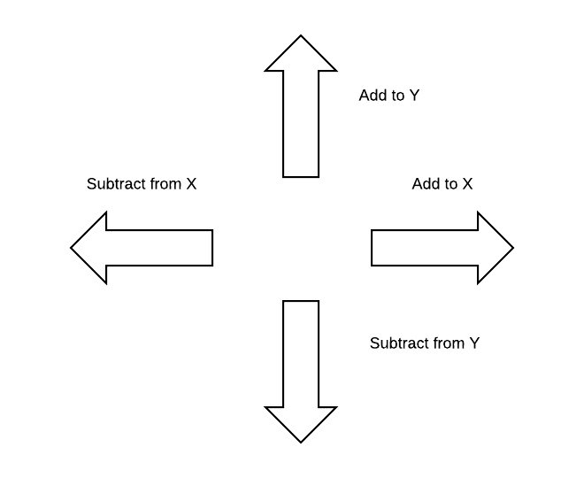

A vector is a container where order matters and repititions are allowed.
An N-vector has n components (elements), each component called  
$$U_1, U_2, ... , U_n$$  
Two vectors can be added like so:

$$ \vec{A} + \vec{B} = \vec{W} = <A_1 + B_1, A_2 + B_2, ... , A_n + B_n>$$
You can only add two vectors if the vectors have the same number of components.

Scalar multiplcation is where you increase every item in a vector by R.
Let R be a real number then:

$$ R * \vec{A} = \vec{W} = <A_1 * R, A_2 * R, ... , A_n * R>$$

The length of a vector a, \|a\|, can be calculated with Pythagoras' formula

$$ |\vec{a}| = \sqrt{({a_{1}  ^2} + {a_2  ^2} + ... + {a_n  ^2})} $$

Some important facts:

$$ |\vec{-a}| = |\vec{a}| $$

$$-v = (-1)v$$

$$u - v = u + (-v)$$

A vector space is a list, V, of n-vectors where each vector is defined strictly using a type of number (real, rational etc) and if and only if:
$$\vec(u), \vec(x) \in V \Rightarrow \vec{u} + \vec{x} \in V $$

Given any number, R, from the original space (real numbers, integers, etc) and $$\vec{u} \in V$$ then $$\vec{u} * R \in V$$

The superscript number ontop of a set of numbers such as $$R^n$$ is the set of all real valued (numbers that are in the real numbers) n-vectors where each component is in the set of Real numbers.

2-vectors have 2 dimensions, X and Y: <X, Y>. 3-vectors have <X, Y, Z>.
