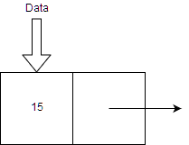
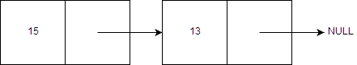
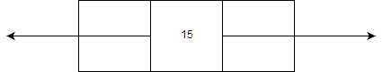
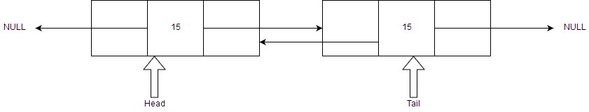
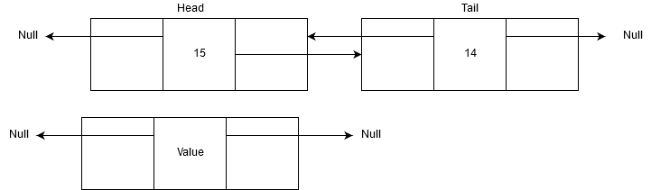
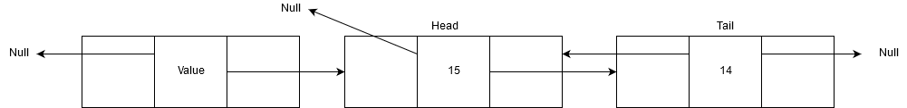
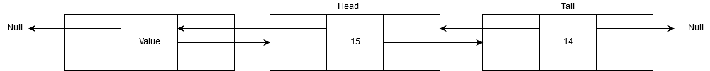
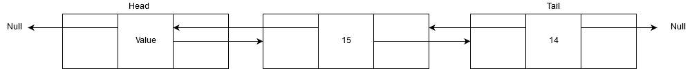

A blockchain is an immutable backwards linked list. If you want to truly understand blockchain you need to understand linked lists.

Linked Lists are a linear collection of data elements. Linearty in a linked list is not defined by each element's physical placement. Instead each data node in a linked list points to one or two other nodes in the linked list.

With an array such as [1, 2, 3] you know that the element 1 is at position [0] and element 2 is at position [1].

The __physical__ placement of each element defines the linearty of the array. This does not happen with linked lists.

Nodes make up elements in linked lists. Every node has a data section to it. As well as data, each node has a "forwards" and "backwards" section pointing to the previous and next node in the list.

In an array if you want to insert an item at [0] you need to shift every element in the array 1 to the right to make space at [0].

With a linked list you can insert data items anywhere in the list without having to shift the entire list. To do this you have to tell the next and previous node to point to this new node.

Let's say you have an array that grows every day. One day the array has 5000 elements in it. To insert an item at [0] you'll have to move 5000 elements.

With a linked list you do not have to shift any items, you can insert them. This makes them useful for lists which may grow in size at an  expeditious rate.

Linked lists are scalable and adaptable.

We call the "forwards" and "backwards" elements of a node the pointers of the node. Nodes have 2 / 3 elements in them depending on whether it is a singly linked list or a doubly linked list.

<a name="singly-linked-list"></a>
## Singly Linked Lists



A Singly Linked List has a data element to it and a pointer pointing to the next node. When the pointer is pointing at nothing we say that it is pointing at Null.

2 __components__ make up the singly linked list node - the data and the pointer.

Singly linked lists cannot point backwards as they do not have a "backwards" pointer.

A pointer does not store any data other than where the next node is. It is literally a pointer.



A new node has been added to show what the singly linked list looks like with more than 1 node in it.

.png)

Depending on the implementation a linked list could also have 2 special pointers - head and tail.

The head pointer points to the very first node in the linked list. The tail pointer points to the last node in the linked list.

If you only have one node in the linked list the convention is for head to point to it and for tail to point to null. Although this is entirely up to the programmers and in some cases head and tail can point to the same singular node.

Programmers create special functions for linked lists to make them mroe usable. These functions are:

* node.data = get data from current node
* node.next = go to next node


<a name="doubly-linked-list"></a>
## Doubly Linked List

A doubly linked list is a singly linked list that has a "backwards" component. 



Each __node__ in a doubly linked list has 3 __components__. A backwards pointer, a data element and a forwards pointer. 



Like with singly linked lists, doubly linked lists have special functions. These functions are:

* node.data = get data from current node
* node.next = go to next node
* node.prev = go to previous node

If you use node.prev on the head node then the function will error or produce a NULL value. If you use node.next on the tail node then the function will error or produce a NULL value.

<a name="traversing-linked-lists"></a>
## Traversing Linked Lists

Something we want to do a lot of with linked lists is to traverse them. Go up and down the linked list.

The first thing we need to do is to define where we start. Well, the starting point of the linked list (head) is a good place.

```python
node = head
```

Now we want a loop that goes through the entire list. We want to go through every single node until the currently selected node is "NULL" or None in Python. Once we hit a "None" node we know we are at the end.

```python
node = head
while node != None:
``` 

Now we want to do something with our linked list as we traverse it. Let's print every data element in every node in our linked list.

```python
node = head
while node != None:
    print(node.data)
``` 

Now to actually move to the next node we use the node.next function:

```python
node = head
while node != None:
    print(node.data)
    node = node.next
```

The notation of:

```
node = node.next
```

is called __dot__ notation because we are calling the linked list's function "next". TK fix

The time complexity to search and traverse through linked lists is O(n). If you do not understand big O notation I highly reccomend this article:

https://hackernoon.com/you-need-to-understand-big-o-notation-now-4ada3d2ec93a


<a name="programming-lniked-lists"></a>
## Programming Linked Lists

Linked Lists aren't available in most languages so we have to program it ourselves.

Because a node will have the same functions and look the same across our linked list it is best to create this as a class.

A class is a template for an __object__. You can create many objects from one class. 

Let's design the linked list in Java.

```java
class Node {
 public int data; 
 public Node next;
 public Node prev;
 
 // constructor to create a new node with data equal to parameter i
 public Node (int i) {
        next = null;
        prev = null;
        data = i;
    }
}
```

You can apply 3 methods to this node using the dot notation:

```
node.next
node.prev
node.data
```

The class has a "constructor" method which runs everytime we make a new node. This initialises the node for us. The constructor method sets the next and previous pointers to point to "null". It then sets the data to "i" which is what the user wants to put into the node.

In this instance the node has 3 methods that can be applied to it. Each method can be applied like:

```
Node.next
Node.prev
Node.data
```

using the dot notation.

If we wanted to make a single node we just need to write this code:

```java
Node newnode = new Node(5);
```

This creates an __instance__ of the Node class and provides the number "5" to it as the data element of that node.

Now of course having one singular node isn't useful at all. We want to add more nodes to the linked list.

Remember that example from earlier where adding an element to the front of an array requires shifting every element to the right by 1?

We're going to show how this is easier done using linked lists.

<a name="linked-lists-head-add"></a>

In order to add a new node to the front of the list we will need a method (function) that does this.

```java
static void insertHead(int value){

}
```

Before we can add a node to the front we first must create a node with the value we want:

```java
static void insertHead(int value){
    NOde newNode = new Node(value);
}
```



Now from our definition of the node class earlier the node's functions node.next and node.prev points to null. Let's change that.

```java
static void insertHead(int value) {
	Node newNode = new Node(value);

	newNode.next = head; // Makes the next node the head of the linked list
}
```

We have not updated the head pointer, so it still points to the head of the linked list which is what we want to make the second node in the linked list. We make the node.next pointer point at where the head pointer is pointing at.



Because we are inserting a new node at the front of the linked list we will need to update the head pointer soon. First, we'll define where the new nodes previous pointer points to.


```java
static void insertHead(int value) {
	Node newNode = new Node(value);

	newNode.next = head; // Makes the next node the head of the linked list
    newNode.prev = null; // makes the previous node empty
}
```

We actually didn't need to update newNode.prev to be null because it's already done in the Node class; however to make things clear the code has been put there.


Now we need to update the second node, the node that the head pointer is still pointing at. It needs to know that node.previous points to an actual node now and not just null.

If the head pointer is not pointing at anything as the linked list has not been created yet then we do not need to update the node.

```java
static void insertHead(int value) {
	Node newNode = new Node(value);

	newNode.next = head; // Makes the next node the head of the linked list
    newNode.prev = null; // makes the previous node empty

    if (head != null) // if the head is not empty
		head.prev = newNode;
}
```



If the head pointer is pointing at a node then inform that node that it's .prev function points to the new node we have just inserted.

```java
static void insertHead(int value) {
	Node newNode = new Node(value);

	newNode.next = head; // Makes the next node the head of the linked list
    newNode.prev = null; // makes the previous node empty

    if (head != null) // if the head is not empty
		head.prev = newNode;
    else
		tail = newNode; // the last node in the list is now the new node
}
```

Else if the head is pointing at nothing make the tail the newNode. Earlier we talked about whether a singular node has a head or tail pointer pointing at it. This is the part where the programmer decides. Here we have elected to make the singular node the tail and the head at the same time.

We now just need to update the head pointer to point to the new head of the linked list:

```java
static void insertHead(int value) {
	Node newNode = new Node(value);

	newNode.next = head; // Makes the next node the head of the linked list
    newNode.prev = null; // makes the previous node empty

    if (head != null) // if the head is not empty
		head.prev = newNode;
    else
		tail = newNode; // the last node in the list is now the new node
    head = newNode;
}
```




<a name="delete-head-lniked-list"></a>
We can also delete a node at the front of the linked list in a similar fashion:

```java
static Node deleteHead() {
	Node curr;
```

We assume here that curr is a pointer that points to any node in the linked list.

We then want to set curr to head, since we're deleting the head node:

```java
static Node deleteHead() {
	Node curr;
    curr = head
}
```

.png)

```java
static Node deleteHead() {
	Node curr;
    curr = head;
    if (curr != null){

    }
}
```

We want to make sure that head is pointing at something. curr is not equal to null as there is a node there.

```java
static Node deleteHead() {
	Node curr;
    curr = head;
    if (curr != null){
        head = head.next;
    }
}
```

We move the head pointer 1 to the right.

.png)

```java
static Node deleteHead() {
	Node curr;
    curr = head;
    if (curr != null){
        head = head.next;
        head.prev = null;
    }
}
```

Now we remove curr.next's pointer

```java
static Node deleteHead() {
	Node curr;
    curr = head;
    if (curr != null){
        head = head.next;
        head.prev = null;
        curr.next = null;
    }
}
```

.png)

Now we have this node sitting in a space doing nothing. We return the node in case we want to do something else with it.

```java
static Node deleteHead() {
	Node curr;
    curr = head;
    if (curr != null){
        head = head.next;
        head.prev = null;
    }
    return curr;
}
```

And that's it! The node is no longer connected to the linked list, thus making it 'deleted'.

<a name="inserting-linked-list"></a>
## Inserting items into a linkedlist

The true power of a linked list is being able to insert items anywhere in them.

Inserting an item anywhere in a linked list is similar to inserting an item at the head. You just change a few variables, the idea is still the same.

```java
static void insertHead(int value) {
	Node newNode = new Node(value);

	newNode.next = curr.next; // Makes the next node the head of the linked list
    newNode.prev = curr; // makes the previous node empty

    if (head != null) // if the head is not empty
		curr.next = newNode;
        curr.prev = newNode;
    curr.next = newNode
}
```

Whenever we want to insert a new node, we just have to tell the node what the next and previous nodes are.

<a name="searching-linked-list"></a>
## Searching over a sorted linked list

Linked lists are normally sorted. Items can be inserted anywhere in a linked list, so it makes sense to put them in the right place. If you have a linked list with data of 3, 4, 6 the programmer would likely put the new node containing 5 between 4 and 6. But this is entirely down to the programmer.

We could use binary search to search the list. But, this is a bad idea. We don't know where the middle of a linked list is. Everytime we wanted to find the middle we would have to count every single node in the list and half that by 2.

We can use a modified version of sequential search to search a linked list.

Assume the linked list is sorted in ascending order. we can use this information to make sequential search faster.

```python
node = head
while node != None and node.data < key:
    node = node.next
if node == None:
    print("Not found")
else if node.data > key:
    print("not found")
else:
    print("found")
```

Since the linked list is sorted sequentially we know that the nodes in the linked list go in some order, like 1, 2, 3, 4, 5 for example. If node.data is more than the key (what we're looking for) we know it's not in the list, because it is sorted.

So if we wanted to find 2.5 we would do this:

```
1 is selected
is 1 goal? - no
is 1 > 2.5? no
2 is selected
is 2 goal? no
is 2 > 2.5? no
3 is selected
is 3 goal? no
is 3 > 2.5? yes - we can assume 2.5 is not in list and thus end the search here
```

There are many search algorithms out there. But most of the time if you know a little bit of information about the data you can change a search algorithm to be more efficient. In general, binary search is extremely effective but here it's not so good. Don't use an algorithm because Stack Overflow says that it is the fastest, best algorithm for the job.

Algorithms are like programming languages. We all have our favourites and sometimes we say that one programming language is better than another (Python, I love you). But at the end of the day it would be foolish and naive to say that one programming language is better than all the others. Use the right tool for the job, and change it if you want to!

# Blockchains

Back to blockchain tecnology. Earlier I said:

> A blockchain is an immutable backwards linked list

So let's work through this.

